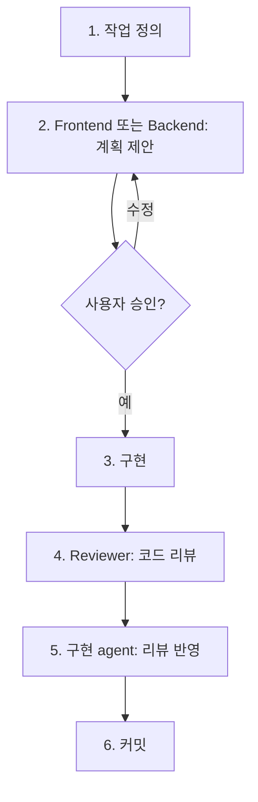
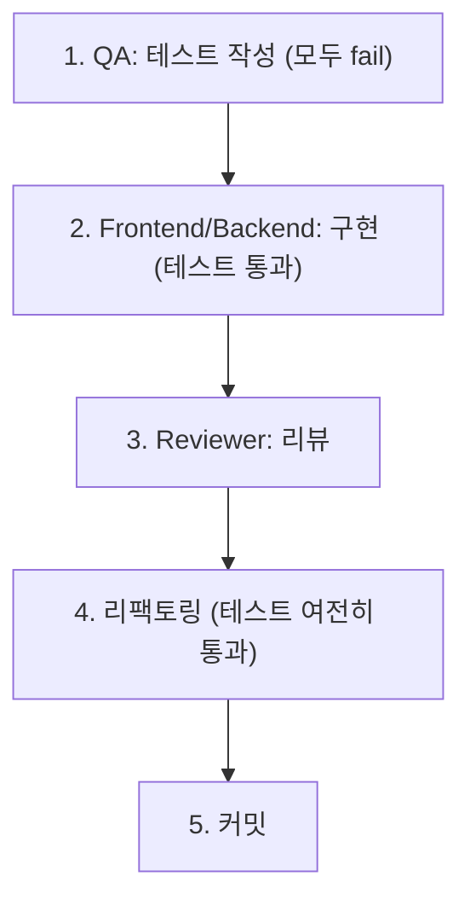

# Typolog — Claude Agent View Workflow

## 개요

이 프로젝트는 Claude Code의 **Agent View**를 활용하여 여러 역할의 agent를 병렬로 운영한다. 한 명의 개발자가 여러 전문가의 도움을 받으며 효율적으로 개발하는 것이 목표.

Agent 정의 파일: `.claude/agents/`

---

## Agent 구성

### 구현 Agent

| Agent | 파일 | 모델 | 담당 |
|-------|------|------|------|
| **Frontend** | `frontend-agent.md` | Sonnet | UI, Canvas, Zustand, 모바일 UX |
| **Backend** | `backend-agent.md` | Sonnet | DB, API, Auth, RLS, Storage, CI/CD |

### 품질 Agent

| Agent | 파일 | 모델 | 담당 |
|-------|------|------|------|
| **QA** | `qa-agent.md` | Sonnet | Vitest, Playwright, 테스트 설계 |
| **Reviewer** | `reviewer-agent.md` | Opus | 코드 리뷰, 보안 검토, 타입 안전성 |

### 전략 Agent

| Agent | 파일 | 모델 | 담당 |
|-------|------|------|------|
| **Product** | `product-agent.md` | Sonnet | MVP 범위, UX 플로우, 지표 설계 |
| **Observability** | `observability-agent.md` | Sonnet | PostHog, Sentry, 이벤트 계측 |

### 학습 Agent

| Agent | 파일 | 모델 | 담당 |
|-------|------|------|------|
| **Mentor** | `mentor-agent.md` | Opus | 개념 설명, 학습 노트 작성 |

### Phase 0 (프로젝트 세팅)

Phase 0의 작업 (프로젝트 생성, 패키지 설치, ESLint, Vercel 연결 등)은 **메인 세션**에서 직접 수행한다. Agent View는 Phase 1부터 본격 활용.

---

## 파일 소유권

**같은 파일을 두 agent가 동시에 수정하지 않는다.**

```
Frontend Agent:
  src/app/(auth)/, src/app/(main)/, src/app/share/
  src/components/, src/stores/, src/hooks/
  src/lib/canvas/, src/lib/utils/

Backend Agent:
  src/app/api/ (OG 이미지 포함), src/db/, src/lib/supabase/, src/types/
  supabase/, middleware.ts
  .github/workflows/, next.config.ts, drizzle.config.ts

QA Agent:
  tests/ (전체), vitest.config.ts, playwright.config.ts

Observability Agent:
  src/lib/analytics/, src/lib/sentry/
  sentry.client.config.ts, sentry.server.config.ts
  docs/events.md

Product Agent:
  docs/ (events.md 제외)

Mentor Agent:
  docs/learning/
```

---

## 작업 패턴

### 기능 구현 사이클



### TDD 사이클 (유틸/API)



### 병렬 작업 패턴

```
동시 가능:
  Frontend가 화면 A + QA가 유틸 B 테스트 (다른 파일)
  Reviewer가 코드 리뷰 + Observability가 이벤트 계측 (다른 관심사)
  Mentor가 개념 설명 + 구현 agent가 작업 (간섭 없음)

순서 필요:
  QA 테스트 작성 → Frontend/Backend 구현
  구현 완료 → Reviewer 리뷰 → 리뷰 반영
  Backend RLS 작성 → Reviewer 보안 검토
```

---

## 작업 단위 쪼개는 기준

**원칙**: "하나의 작업 = 하나의 의미있는 커밋"

| 기준 | 예시 |
|------|------|
| 화면 단위 | "홈 화면 구현", "피드 화면 구현" |
| 기능 단위 | "이미지 crop 기능", "좋아요 토글" |
| 레이어 단위 | "API 구현", "UI 구현", "테스트 작성" |
| 파일 5개 이내 | 초과 시 작업 쪼개기 |

**쪼개면 안 되는 경우**:
- DB 스키마 변경 + RLS 정책 → 함께 배포해야 보안 유지
- 컴포넌트 + 해당 스타일 → 분리하면 깨진 UI가 커밋됨

---

## 충돌 발생 시

1. `git status`로 변경 파일 확인
2. 충돌 파일이 있으면 한쪽이 먼저 커밋
3. 다른 쪽이 최신 상태에서 작업 재개

---

## 요약

```
구현: Frontend가 UI를 만들고, Backend가 API/DB를 만든다.
검증: QA가 테스트하고, Reviewer가 리뷰하고 보안을 점검한다.
전략: Product가 방향을 잡고, Observability가 측정한다.
학습: Mentor가 모르는 개념을 설명한다.

효율의 핵심:
"같은 파일을 동시에 건드리지 않고, 다른 영역은 병렬로 진행한다."
```
