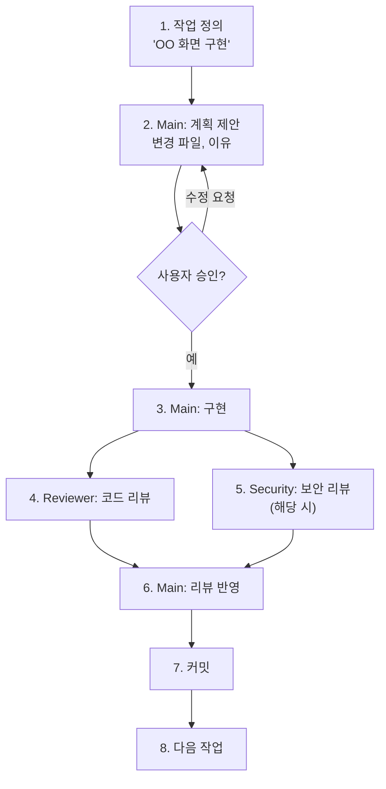
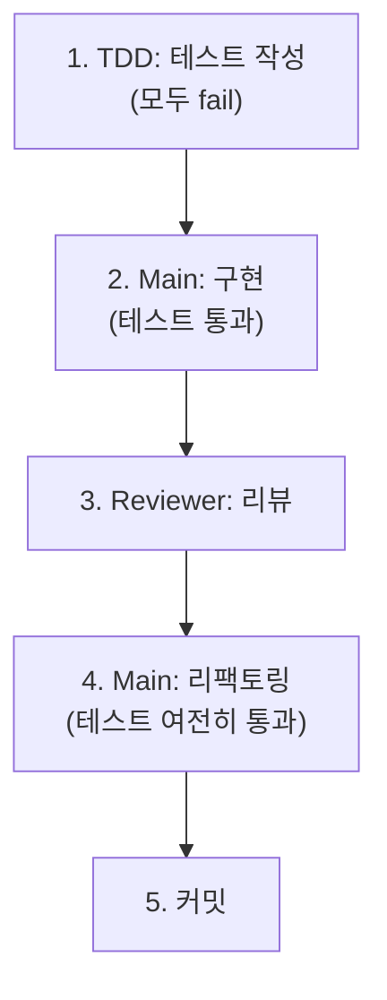
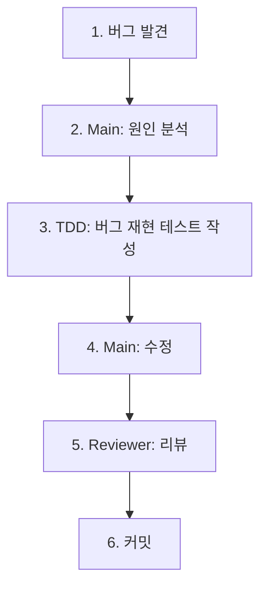

# Typolog — Claude Agent View Workflow

## 개요

이 프로젝트는 Claude Code의 **Agent View**를 활용하여 여러 역할의 agent를 병렬로 운영한다. 한 명의 개발자가 여러 전문가의 도움을 받으며 효율적으로 개발하는 것이 목표.

### Agent View란?

Claude Code에서 여러 agent를 동시에 띄워 각각 다른 역할을 맡길 수 있는 기능. 각 agent는 독립적인 컨텍스트에서 작업하며, 파일 시스템을 통해 결과를 공유한다.

---

## 추천 Agent 역할

### 상시 운영 Agent

| 역할 | 이름 | 설명 | 활성화 시점 |
|------|------|------|-----------|
| **메인 개발자** | Main | 핵심 기능 구현, 아키텍처 결정 | 항상 |
| **코드 리뷰어** | Reviewer | 작성된 코드 품질, 보안, 일관성 검토 | 기능 완성 후 |

### 필요 시 투입 Agent

| 역할 | 이름 | 설명 | 투입 시점 |
|------|------|------|----------|
| **보안 리뷰어** | Security | RLS 정책, Storage 권한, EXIF strip 검증 | DB/Storage/인증 변경 시 |
| **TDD 가이드** | TDD | 테스트 먼저 작성, 커버리지 확인 | Canvas 유틸, API 핸들러 작성 시 |
| **빌드 해결사** | BuildFix | 타입 에러, 빌드 실패 수정 | 빌드 실패 시 |
| **E2E 테스터** | E2E | Playwright 테스트 작성/실행 | 화면 완성 후 |
| **아키텍트** | Architect | 폴더 구조, 도메인 설계 리뷰 | 새 도메인 추가 시 |

---

## 각 Agent에게 맡길 작업

### Main (메인 개발자)

**역할**: 핵심 기능을 직접 구현하는 주 개발자.

맡길 작업:
- 새 페이지/컴포넌트 구현
- API Route Handler / Server Action 작성
- Supabase 스키마 변경, RLS 정책 초안
- Zustand store, TanStack Query hook 작성
- Canvas 유틸 (crop, collage) 구현
- 버그 수정

지시 예시:
```
"오늘의 챌린지 화면(/)을 구현해줘.
- mock 데이터 사용 (Phase 1)
- 문장과 시작하기 버튼 표시
- 모바일 우선 레이아웃
- 변경할 파일과 이유를 먼저 설명하고, 승인 후 코드 작성"
```

### Reviewer (코드 리뷰어)

**역할**: Main이 작성한 코드를 독립적으로 검토.

맡길 작업:
- 코드 품질 리뷰 (naming, 구조, 중복)
- TypeScript 타입 안전성 검토
- React 패턴 (불필요한 리렌더링, effect 남용 등) 검토
- 에러 핸들링 누락 확인
- 접근성(a11y) 기본 확인

지시 예시:
```
"방금 작성된 /challenge/[id]/page.tsx와 관련 파일들을 리뷰해줘.
- 코드 품질, 타입 안전성, React 패턴 관점에서
- 심각도 (critical/warning/suggestion)로 분류
- 각 피드백에 수정 제안 포함"
```

### Security (보안 리뷰어)

**역할**: 보안과 프라이버시에 집중한 리뷰.

맡길 작업:
- RLS 정책이 의도대로 동작하는지 검증
- Storage 접근 권한 검토
- EXIF strip이 완전한지 확인
- 파일 업로드 검증 (타입, 크기, 악성 파일)
- 인증/인가 로직 검토
- XSS, CSRF 등 OWASP Top 10 체크

지시 예시:
```
"submissions 테이블의 RLS 정책을 검토해줘.
- 타인의 비공개 제출을 조회할 수 없는지
- 타인의 제출을 수정할 수 없는지
- hidden 상태 변경이 서비스 키로만 가능한지
- 우회 가능한 시나리오가 있는지"
```

### TDD (TDD 가이드)

**역할**: 테스트를 먼저 작성하고, 구현이 테스트를 통과하는지 확인.

맡길 작업:
- Canvas 유틸(crop, collage) 테스트 먼저 작성
- API Route Handler 테스트 먼저 작성
- Zod 스키마 validation 테스트
- Zustand store 상태 전이 테스트

지시 예시:
```
"crop 유틸(lib/canvas/crop.ts)의 테스트를 먼저 작성해줘.
- 정상 crop, 경계 케이스, 에러 케이스 포함
- fixture 이미지 필요하면 생성
- 테스트가 모두 fail하는 상태로 작성 완료 후 알려줘
- 그 다음에 Main이 구현할 거야"
```

### BuildFix (빌드 해결사)

**역할**: 빌드 에러와 타입 에러를 빠르게 해결.

맡길 작업:
- `npm run build` 실패 시 에러 수정
- TypeScript 타입 에러 수정
- ESLint 에러 수정
- 의존성 충돌 해결

지시 예시:
```
"빌드가 실패했어. 에러 메시지:
[에러 메시지 붙여넣기]
- 최소한의 변경으로 빌드를 통과시켜줘
- 아키텍처 변경은 하지 마"
```

### E2E (E2E 테스터)

**역할**: Playwright로 핵심 유저 플로우를 자동 검증.

맡길 작업:
- E2E 테스트 시나리오 작성
- 테스트 실행 및 결과 분석
- 스크린샷 기반 시각적 검증
- 모바일 뷰포트 테스트

지시 예시:
```
"핵심 플로우 E2E 테스트를 작성해줘:
1. 로그인
2. 오늘의 챌린지 확인
3. 글자 수집 (이미지 업로드 → crop → 슬롯 저장) × 6글자
4. 콜라주 미리보기 확인
5. 제출
- iPhone 14 뷰포트 기준
- 카메라 대신 이미지 업로드 사용
- fixture 이미지 포함"
```

---

## Agent 간 충돌을 피하는 규칙

### 규칙 1: 파일 소유권

**같은 파일을 동시에 수정하지 않는다.**

```
Main이 작업 중인 파일 → Reviewer는 읽기만
Security가 RLS SQL 작성 중 → Main은 다른 작업
TDD가 테스트 작성 중 → Main은 테스트 대상 파일 수정 안 함
```

### 규칙 2: 순차 실행 패턴

```
[순서가 필요한 작업]
1. TDD가 테스트 작성 (fail 상태)
2. Main이 구현 (테스트 통과)
3. Reviewer가 코드 리뷰
4. Security가 보안 리뷰 (해당 시)
5. Main이 리뷰 반영
```

### 규칙 3: 병렬 실행 패턴

```
[동시에 해도 되는 작업]
- Main이 화면 A 구현 + TDD가 유틸 B 테스트 작성 (다른 파일)
- Reviewer가 화면 A 리뷰 + Security가 RLS 정책 리뷰 (다른 관심사)
- BuildFix가 타입 에러 수정 + E2E가 테스트 시나리오 설계 (다른 영역)
```

### 규칙 4: 충돌 발생 시

1. git status로 변경 파일 확인
2. 충돌 파일이 있으면 한쪽이 먼저 커밋
3. 다른 쪽이 최신 상태에서 작업 재개

---

## Daily Workflow

### 작업 시작 시

```
1. 오늘 할 작업 확인 (로드맵 Phase + 태스크)
2. 작업을 agent 단위로 분배
3. 의존 관계 확인 → 순서 결정
```

### 기능 구현 사이클



### TDD 사이클 (유틸/API)



### 버그 수정 사이클



---

## 작업 단위 쪼개는 기준

### 원칙: "하나의 작업 = 하나의 의미있는 커밋"

### 쪼개기 기준

| 기준 | 예시 | 이유 |
|------|------|------|
| **화면 단위** | "홈 화면 구현", "피드 화면 구현" | 한 화면이 하나의 작업 단위 |
| **기능 단위** | "이미지 crop 기능", "좋아요 토글" | 독립적으로 동작하는 기능 |
| **레이어 단위** | "API 구현", "UI 구현", "테스트 작성" | 관심사 분리 |
| **파일 5개 이내** | 한 작업에서 수정하는 파일이 5개 초과 시 쪼개기 | 리뷰 가능한 크기 |

### 쪼개기 예시

**"글자 수집 화면 구현"이 너무 크다면:**

```
작업 1: 글자 슬롯 그리드 UI (LetterGrid, LetterSlot 컴포넌트)
작업 2: 카메라/갤러리 접근 (바텀시트, input, 파일 선택)
작업 3: 이미지 crop 기능 (Canvas crop UI, crop 유틸)
작업 4: crop 이미지를 슬롯에 저장 (Zustand store, localStorage persist)
작업 5: 전체 연결 + 글자 교체 기능
```

### 쪼개면 안 되는 경우

- DB 스키마 변경 + RLS 정책 → 함께 배포해야 보안 유지
- 컴포넌트 + 해당 컴포넌트의 스타일 → 분리하면 깨진 UI가 커밋됨

---

## 실전 시나리오

### 시나리오: Phase 1 — crop 기능 구현

```
[시작]
나: "이미지 crop 기능을 구현하자. Canvas API 기반으로."

[Agent 분배]
TDD Agent: crop 유틸 테스트 먼저 작성
  → tests/unit/canvas/crop.test.ts
  → 정상 crop, 경계 케이스, 잘못된 입력

Main Agent: TDD의 테스트를 참고하여 crop 유틸 구현
  → src/lib/canvas/crop.ts

Main Agent: crop UI 컴포넌트 구현
  → src/components/challenge/image-cropper.tsx

Reviewer Agent: crop 유틸 + UI 리뷰
  → "Canvas context null 체크 필요", "터치 이벤트 passive 옵션 추가"

Main Agent: 리뷰 반영

[완료]
나: "커밋하자."
```

### 시나리오: Phase 2 — submissions RLS 설정

```
[시작]
나: "submissions 테이블 RLS 정책을 만들자."

[Agent 분배]
Main Agent: RLS 정책 SQL 초안 작성
  → supabase/migrations/xxx_submissions_rls.sql

Security Agent: RLS 정책 검토
  → "타인의 draft 접근이 가능한 취약점 발견. USING 조건 수정 필요"

Main Agent: Security 피드백 반영

Security Agent: 재검토 → 통과

[완료]
나: "커밋하자."
```

---

## 요약

```
한 줄 원칙:
"Main이 만들고, TDD가 검증하고, Reviewer가 검토하고, Security가 보호한다."

효율의 핵심:
"같은 파일을 동시에 건드리지 않고, 다른 영역은 병렬로 진행한다."
```
