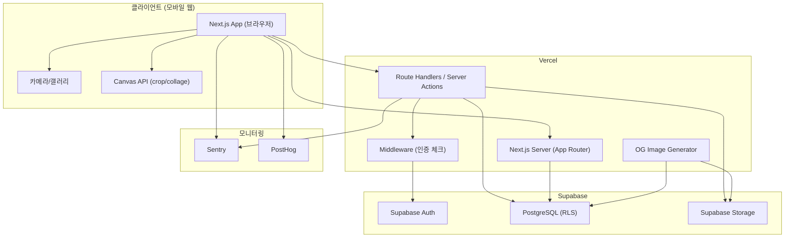
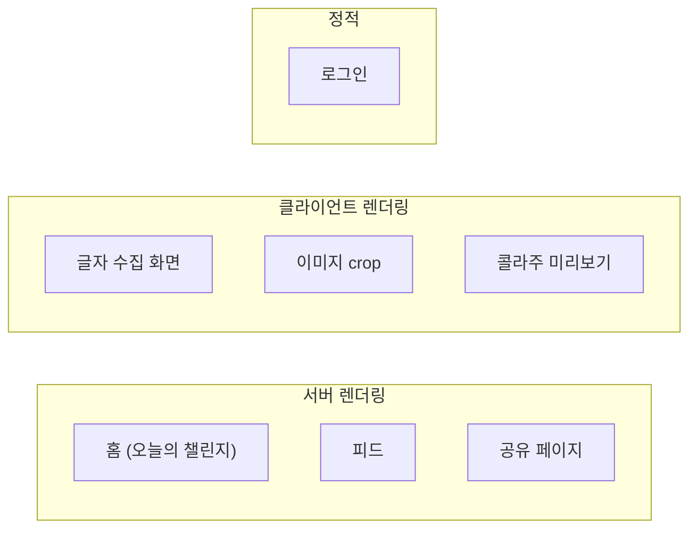
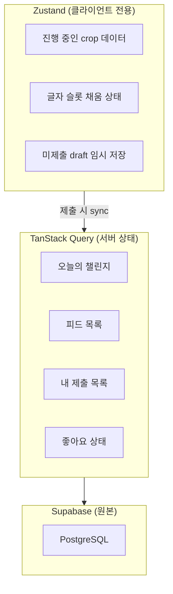
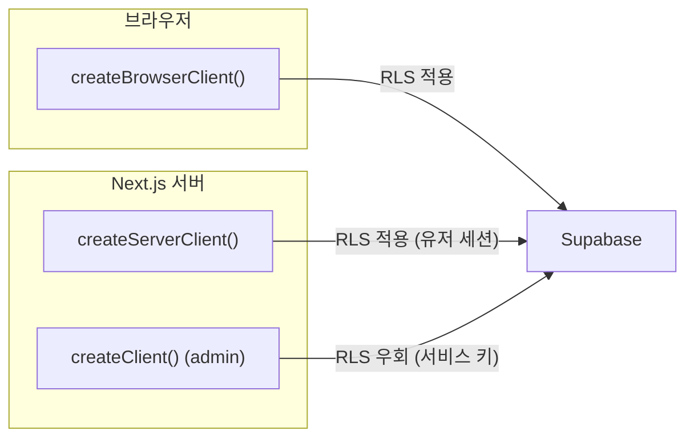
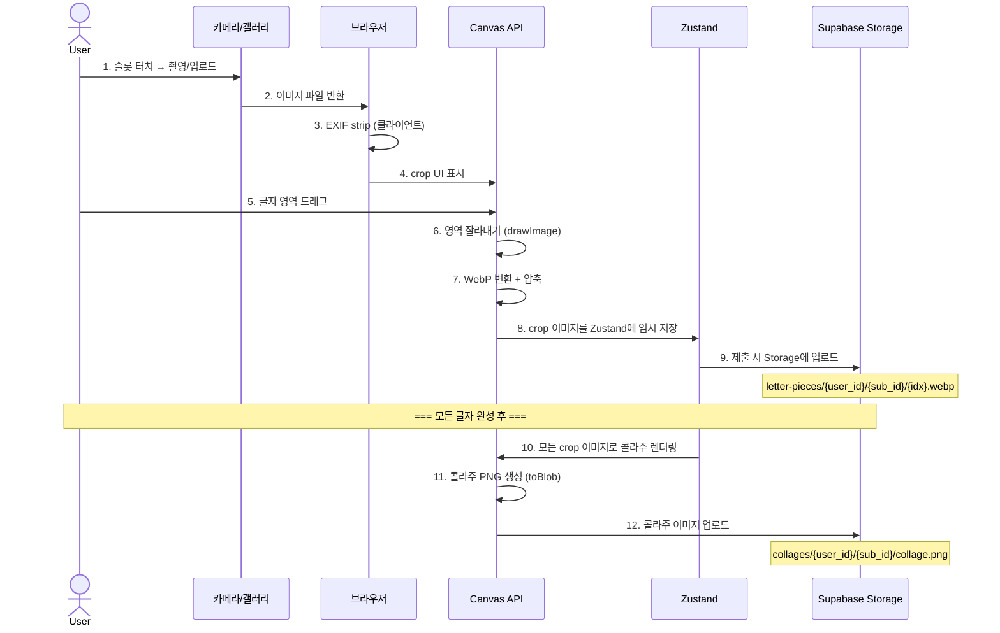
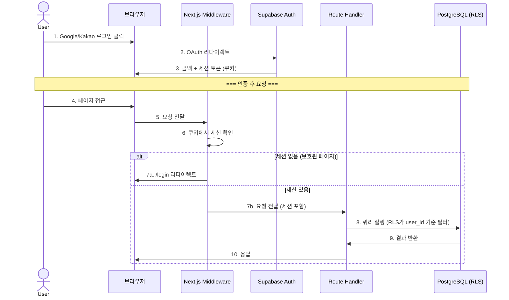

# Typolog — Architecture

## 전체 시스템 구조



## 프론트엔드 구조

### 기술 스택

| 역할 | 기술 | 이유 |
|------|------|------|
| 프레임워크 | Next.js 15 App Router | SSR/SSG, API Routes, 이미지 최적화 |
| 언어 | TypeScript (strict) | 타입 안전성 |
| 스타일 | Tailwind CSS 4 + shadcn/ui | 빠른 UI 개발, 커스터마이즈 용이 |
| 클라이언트 상태 | Zustand | 간결한 API, persist middleware |
| 서버 상태 | TanStack Query v5 | 캐싱, 자동 재시도, optimistic update |
| 폼 | react-hook-form + zod | 검증 로직 공유 (클라이언트/서버) |
| 이미지 crop | Canvas API (직접 구현) | 번들 크기 최소화, 커스텀 UX |
| 콜라주 생성 | Canvas API | 서버 의존 없이 클라이언트에서 이미지 생성 |
| 콜라주 줄 배치 | Challenge.lines (작성자 지정) | 줄나눔을 알고리즘으로 추측하지 않고 작성자가 의도대로 지정. 수집/preview/PNG 동일 |
| dev 관측(로깅) | 구조화 로거 `src/lib/debug/log.ts` (콘솔+세션버퍼+내보내기) | sink 확장형 — Phase 2에 OpenSearch/PostHog/Sentry sink만 추가하면 원격 수집 가능 |

### 렌더링 전략



| 페이지 | 렌더링 | 이유 |
|--------|--------|------|
| 홈 (`/`) | SSR | 오늘의 챌린지 데이터를 서버에서 fetch |
| 글자 수집 (`/challenge/[id]`) | CSR 중심 | 카메라, Canvas 등 브라우저 API 집중 사용 |
| 콜라주 미리보기 (`/challenge/[id]/preview`) | CSR | Canvas 렌더링 |
| 오늘의 피드 (`/feed/today`) | SSR + CSR hydration | 초기 데이터는 서버, 이후 무한스크롤은 클라이언트 |
| 유저 프로필 (`/u/[handle]`) | SSR + CSR hydration | 유저의 공개 콜라주 목록 |
| 공유 (`/s/[id]`) | SSR | OG 메타태그를 위해 서버 렌더링 필수 |
| 로그인 (`/login`) | 정적 | OAuth 버튼만 표시 |

### 상태 관리 경계



**원칙**: 
- 서버에 저장된 데이터 → TanStack Query
- 아직 서버에 없는 진행 중 데이터 → Zustand (+ localStorage persist)
- 제출(submit) 시점에 Zustand → Server → TanStack Query 순으로 동기화

## 백엔드 구조

### API 레이어

Next.js Route Handlers와 Server Actions를 혼합 사용한다.

```
src/app/api/
├── challenges/
│   ├── route.ts          # GET: 챌린지 목록 (향후)
│   └── today/
│       └── route.ts      # GET: 오늘의 챌린지
├── submissions/
│   ├── route.ts          # POST: 새 제출 생성
│   └── [id]/
│       ├── route.ts      # GET, PATCH: 제출 조회/업데이트
│       ├── letters/
│       │   └── route.ts  # POST: 글자 조각 업로드
│       └── collage/
│           └── route.ts  # POST: 콜라주 이미지 업로드
├── feed/
│   └── route.ts          # GET: 공개 피드 (cursor pagination)
├── reactions/
│   └── route.ts          # POST: 좋아요 토글
├── reports/
│   └── route.ts          # POST: 신고
├── profiles/
│   └── route.ts          # PATCH: 프로필 수정
└── og/
    └── [id]/
        └── route.tsx     # GET: OG 이미지 동적 생성
```

### Route Handler vs Server Action 기준

| 상황 | 선택 | 이유 |
|------|------|------|
| 데이터 조회 (GET) | Route Handler | TanStack Query와 연동 |
| 파일 업로드 포함 | Route Handler | multipart/form-data 처리 |
| 단순 mutation (좋아요, 프로필 수정) | Server Action | form 기반, 간결 |
| 외부 공유/OG | Route Handler | 비인증 GET 접근 필요 |

## Supabase 사용 방식

### 클라이언트 종류



| 클라이언트 | 사용처 | RLS | 용도 |
|-----------|--------|-----|------|
| Browser Client | 클라이언트 컴포넌트 | O | 실시간 조회, 파일 업로드 |
| Server Client | Server Components, Route Handlers | O | 인증된 서버 조회/변경 |
| Admin Client | Server Actions (관리 작업만) | X | 챌린지 등록, 신고 처리 등 |

### Drizzle ORM 연동

```
Drizzle Schema (src/db/schema.ts)
  ↓ 타입 생성
TypeScript Types
  ↓ 사용
Route Handlers / Server Actions
  ↓ SQL 실행
Supabase PostgreSQL
```

Drizzle은 쿼리 빌더 + 타입 생성기 역할. Supabase의 JS 클라이언트 대신 Drizzle로 직접 PostgreSQL에 쿼리한다. Supabase JS 클라이언트는 Auth와 Storage에만 사용한다.

## Storage 사용 방식

### 버킷 구조

```
Supabase Storage
├── letter-pieces/          (Private)
│   └── {user_id}/
│       └── {submission_id}/
│           ├── 0.webp      (slot_index별)
│           ├── 1.webp
│           └── ...
├── collages/               (Private — RLS 정책으로 공개 제출만 접근 허용)
│   └── {user_id}/
│       └── {submission_id}/
│           └── collage.png
└── avatars/                (Public)
    └── {user_id}/
        └── avatar.webp
```

### Storage 접근 정책

| 버킷 | 읽기 | 쓰기 | 삭제 |
|------|------|------|------|
| `letter-pieces` | 본인만 | 본인만 | 본인만 |
| `collages` | 공개 제출: 모두 / 비공개: 본인만 | 본인만 | 본인만 |
| `avatars` | 모두 | 본인만 | 본인만 |

## 이미지 처리 흐름



### 이미지 처리 핵심 규칙

1. **EXIF strip**: 업로드 전 클라이언트에서 반드시 EXIF 메타데이터 제거 (위치 정보 노출 방지)
2. **원본 미저장**: 원본 사진은 서버에 전송하지 않음. crop된 영역만 저장
3. **클라이언트 처리**: crop과 콜라주 생성 모두 브라우저 Canvas에서 수행 (서버 부하 없음)
4. **포맷**: 글자 조각은 WebP (용량 절약), 최종 콜라주는 PNG (공유 호환성)
5. **크기 제한**: 글자 조각 500KB, 콜라주 2MB

## 인증/권한 흐름



### 인증 흐름 핵심 포인트

1. **Supabase Auth**가 세션을 관리 (JWT 기반, 쿠키 저장)
2. **Next.js Middleware**가 보호 페이지 접근 시 세션 유무를 확인
3. **RLS (Row Level Security)** 가 DB 레벨에서 데이터 접근을 제어
4. 비인증 접근 가능: `/login`, `/s/[id]`, `/api/og/[id]`, `/api/challenges/today`

### 페이지별 인증 요구사항

| 페이지 | 인증 필요 | 이유 |
|--------|----------|------|
| `/login` | X | 로그인 페이지 |
| `/` (홈) | O | 챌린지 시작을 위해 |
| `/challenge/[id]` | O | 글자 수집/저장 |
| `/challenge/[id]/preview` | O | 콜라주 생성/제출 |
| `/feed/today` | O | 좋아요 기능 (조회만은 비인증 가능하나 MVP에서는 인증 필수) |
| `/u/[handle]` | 조건부 | 공개 프로필은 비인증 열람 가능, 본인 수정은 인증 필요 |
| `/s/[id]` | X | 공유 링크는 누구나 접근 가능 |
| `/admin/challenges` | O | 관리자만 접근 |
