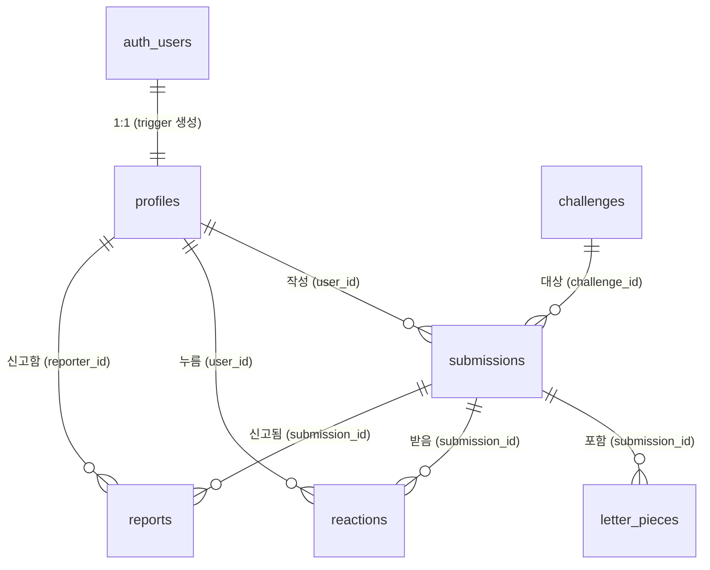
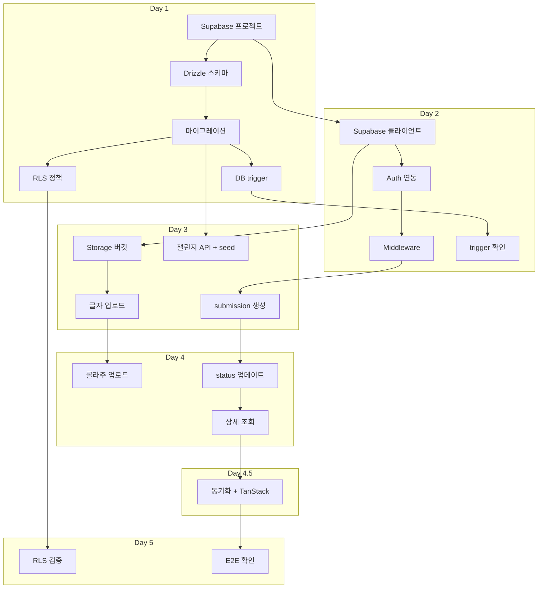

# Typolog — 백엔드/Supabase 설계 계획

> Phase 2~3 구현 전 정리하는 백엔드 설계 문서.
> 코드 작성 전에 전체 그림을 먼저 잡는다.

---

## 목차

1. [테이블 설계](#1-테이블-설계)
2. [관계 설계](#2-관계-설계)
3. [RLS 정책 초안](#3-rls-정책-초안)
4. [Storage 버킷 구조](#4-storage-버킷-구조)
5. [이미지 접근 권한 정책](#5-이미지-접근-권한-정책)
6. [API/Server Action 목록](#6-apiserver-action-목록)
7. [Validation 전략](#7-validation-전략)
8. [보안/개인정보 리스크](#8-보안개인정보-리스크)
9. [구현 순서](#9-구현-순서)
10. [이해해야 할 백엔드 개념](#10-이해해야-할-백엔드-개념)

---

## 1. 테이블 설계

### 전체 테이블 목록 (6개)

| 테이블 | 역할 | 레코드 수 예상 (베타 1개월) |
|--------|------|---------------------------|
| `profiles` | 사용자 프로필 (auth.users 확장) | ~100 |
| `challenges` | 오늘의 챌린지 문장 | ~30 |
| `submissions` | 사용자의 제출물 (draft/completed/hidden) | ~500 |
| `letter_pieces` | 글자 조각 이미지 메타데이터 | ~3,000 |
| `reactions` | 좋아요 | ~1,000 |
| `reports` | 신고 | ~10 |

> `event_logs`는 MVP에서 DB 테이블로 만들지 않는다. PostHog으로 전송.

---

### 1.1 profiles

```sql
CREATE TABLE profiles (
  id          UUID PRIMARY KEY REFERENCES auth.users(id) ON DELETE CASCADE,
  nickname    TEXT NOT NULL,
  avatar_url  TEXT,
  created_at  TIMESTAMPTZ NOT NULL DEFAULT now(),
  updated_at  TIMESTAMPTZ NOT NULL DEFAULT now()
);

-- 자동 생성 trigger
CREATE OR REPLACE FUNCTION public.handle_new_user()
RETURNS TRIGGER AS $$
BEGIN
  INSERT INTO public.profiles (id, nickname)
  VALUES (
    NEW.id,
    LEFT(
      COALESCE(
        NEW.raw_user_meta_data->>'name',
        'user_' || LEFT(NEW.id::TEXT, 8)
      ),
      20
    )
  );
  RETURN NEW;
END;
$$ LANGUAGE plpgsql SECURITY DEFINER SET search_path = '';

-- trigger 함수는 직접 호출될 일이 없다 — 기본 부여되는 EXECUTE 회수 (공개 API화 방지)
REVOKE EXECUTE ON FUNCTION public.handle_new_user() FROM PUBLIC, anon, authenticated;

CREATE TRIGGER on_auth_user_created
  AFTER INSERT ON auth.users
  FOR EACH ROW
  EXECUTE FUNCTION public.handle_new_user();
```

**설계 포인트**:
- PK가 `auth.users(id)`와 동일 → 1:1 관계
- `SECURITY DEFINER`: trigger 함수가 RLS를 우회해서 INSERT 가능. `SET search_path = ''`로 search_path 하이재킹 방지(본문은 `public.profiles`로 정규화), `REVOKE EXECUTE`로 anon/authenticated의 직접 호출 차단 — public 스키마 함수는 기본적으로 PUBLIC에 EXECUTE가 부여되기 때문 (§8.4-③)
- `nickname` 기본값: OAuth에서 가져온 이름 또는 `user_` + UUID 앞 8자리. `LEFT(..., 20)` 클램프로 validation 규칙(2~20자, §7.2)과 정합
- `updated_at`은 수동 관리 (UPDATE 시 `now()` 세팅) — Drizzle에서 처리

**MVP에서 하지 않는 것**:
- `nickname` UNIQUE 제약 없음 (중복 허용)
- `avatar_url`은 필드만 예약, 업로드 기능 미구현

---

### 1.2 challenges

```sql
CREATE TABLE challenges (
  id          UUID PRIMARY KEY DEFAULT gen_random_uuid(),
  sentence    TEXT NOT NULL,
  lines       TEXT[] NOT NULL,
  letters     TEXT[] NOT NULL,
  active_date DATE NOT NULL UNIQUE,
  created_at  TIMESTAMPTZ NOT NULL DEFAULT now()
);

-- active_date 단독 인덱스 없음 — UNIQUE 제약이 생성하는 인덱스가 날짜 조회를 커버 (Day 2, QA M2 중복 제거)
```

**설계 포인트**:
- `active_date UNIQUE` → 날짜당 정확히 1개 문장 (이 제약이 만드는 인덱스가 조회도 커버 — 별도 인덱스 불필요)
- `lines`는 **작성자가 지정한 줄 배열**(콜라주 줄 배치의 단일 소스). 예: "우리 동네 맛집" → `{'우리 동네','맛집'}` (단어 "동네"가 끊기지 않도록 작성자가 의도)
- `sentence`(표시용) = `lines`를 공백으로 join, `letters`(슬롯용) = `lines`의 각 줄에서 공백/특수문자 제거 후 flatten (예: "오늘도 화이팅" → `{'오','늘','도','화','이','팅'}`)
- seed SQL로 등록. Phase 2 관리자 UI는 줄별 입력(↔ `lines`). 현재 관리자 UI 없음
- 비인증 사용자도 조회 가능 (공유 페이지에서 문장 표시 필요)

**왜 letters/lines를 별도로 저장하나?**
- 클라이언트에서 "공백 제거"·"줄나눔" 로직을 중복 구현하지 않기 위해
- 서버에서 정답(슬롯 개수, 글자 순서, 줄 배치)을 한 번에 내려줌
- 줄 배치는 `lines`가 담당 — 알고리즘 줄나눔이 한글 단어를 중간에 끊는 문제를 작성자 지정으로 회피

---

### 1.3 submissions

```sql
CREATE TABLE submissions (
  id                UUID PRIMARY KEY DEFAULT gen_random_uuid(),
  user_id           UUID NOT NULL REFERENCES profiles(id) ON DELETE CASCADE,
  challenge_id      UUID NOT NULL REFERENCES challenges(id),
  status            TEXT NOT NULL DEFAULT 'draft'
                    CHECK (status IN ('draft', 'completed', 'hidden')),
  is_public         BOOLEAN NOT NULL DEFAULT true,
  collage_image_url TEXT,
  created_at        TIMESTAMPTZ NOT NULL DEFAULT now(),
  completed_at      TIMESTAMPTZ,

  UNIQUE (user_id, challenge_id)
);

-- 피드 쿼리용 부분 인덱스
CREATE INDEX idx_submissions_feed
  ON submissions(challenge_id, created_at DESC, id)
  WHERE status = 'completed' AND is_public = true;

-- 사용자별 제출 목록
CREATE INDEX idx_submissions_user
  ON submissions(user_id, created_at DESC);
```

**상태 전이**:
```
[시작] → draft → completed → hidden (관리자/신고)
                      ↓
              is_public 토글 가능
```

**설계 포인트**:
- `UNIQUE (user_id, challenge_id)`: 사용자당 챌린지당 1개 제한
- `status = 'hidden'`으로의 전환은 서비스 키(Admin Client)만 가능
- `completed_at`은 모든 글자를 채우고 제출할 때 설정
- `collage_image_url`은 콜라주 PNG 업로드 후 채워짐
- `challenges(id)`에는 ON DELETE CASCADE 없음 — 챌린지는 삭제하지 않음

---

### 1.4 letter_pieces

```sql
CREATE TABLE letter_pieces (
  id            UUID PRIMARY KEY DEFAULT gen_random_uuid(),
  submission_id UUID NOT NULL REFERENCES submissions(id) ON DELETE CASCADE,
  character     TEXT NOT NULL,
  slot_index    INTEGER NOT NULL,
  image_url     TEXT NOT NULL,
  width         INTEGER NOT NULL,
  height        INTEGER NOT NULL,
  created_at    TIMESTAMPTZ NOT NULL DEFAULT now(),

  UNIQUE (submission_id, slot_index)
);

CREATE INDEX idx_letter_pieces_submission
  ON letter_pieces(submission_id);
```

**설계 포인트**:
- `UNIQUE (submission_id, slot_index)`: 같은 슬롯에 두 장 불가
- 글자 교체 시 UPSERT: `ON CONFLICT (submission_id, slot_index) DO UPDATE`
- `character`는 표시/검증용 (OCR 안 함, 이미지 내용과 불일치해도 허용)
- `width`, `height`는 콜라주 렌더링 시 비율 계산용
- CASCADE: submission 삭제 시 글자 조각도 함께 삭제

---

### 1.5 reactions

```sql
CREATE TABLE reactions (
  id            UUID PRIMARY KEY DEFAULT gen_random_uuid(),
  user_id       UUID NOT NULL REFERENCES profiles(id) ON DELETE CASCADE,
  submission_id UUID NOT NULL REFERENCES submissions(id) ON DELETE CASCADE,
  type          TEXT NOT NULL DEFAULT 'like',
  created_at    TIMESTAMPTZ NOT NULL DEFAULT now(),

  UNIQUE (user_id, submission_id)
);

CREATE INDEX idx_reactions_submission ON reactions(submission_id);
```

**설계 포인트**:
- MVP에서 `type`은 `'like'`만 사용. 향후 이모지 확장 시 UNIQUE를 `(user_id, submission_id, type)`으로 변경
- 좋아요 토글 = INSERT or DELETE (UPDATE 없음)
- 자기 제출에 좋아요 허용 (제한 안 함)

---

### 1.6 reports

```sql
CREATE TABLE reports (
  id            UUID PRIMARY KEY DEFAULT gen_random_uuid(),
  reporter_id   UUID NOT NULL REFERENCES profiles(id) ON DELETE CASCADE,
  submission_id UUID NOT NULL REFERENCES submissions(id) ON DELETE CASCADE,
  reason        TEXT NOT NULL,
  created_at    TIMESTAMPTZ NOT NULL DEFAULT now()
);
```

**설계 포인트**:
- 중복 신고 허용 (UNIQUE 없음, MVP 단순화)
- 자유 텍스트 사유. 카테고리 분류 미적용
- 신고 내역은 일반 사용자 조회 불가 (관리자만)
- 처리: 관리자가 SQL로 확인 → `submissions.status = 'hidden'` 수동 처리

---

## 2. 관계 설계

### ER 다이어그램



### 관계 요약

| 관계 | 타입 | FK 위치 | CASCADE |
|------|------|---------|---------|
| auth.users → profiles | 1:1 | profiles.id | ON DELETE CASCADE |
| profiles → submissions | 1:N | submissions.user_id | ON DELETE CASCADE |
| challenges → submissions | 1:N | submissions.challenge_id | 삭제 안 함 |
| submissions → letter_pieces | 1:N | letter_pieces.submission_id | ON DELETE CASCADE |
| submissions → reactions | 1:N | reactions.submission_id | ON DELETE CASCADE |
| submissions → reports | 1:N | reports.submission_id | ON DELETE CASCADE |
| profiles → reactions | 1:N | reactions.user_id | ON DELETE CASCADE |
| profiles → reports | 1:N | reports.reporter_id | ON DELETE CASCADE |

### CASCADE 삭제 체인

사용자가 계정을 삭제하면:
```
auth.users 삭제
  → profiles 삭제
    → submissions 삭제
      → letter_pieces 삭제
      → reactions (받은 것) 삭제
      → reports (받은 것) 삭제
    → reactions (누른 것) 삭제
    → reports (신고한 것) 삭제
```

> **주의**: Storage 파일은 CASCADE로 자동 삭제되지 않는다. 계정 삭제 시 Storage cleanup을 별도로 처리해야 함 (MVP에서는 수동 처리 또는 미처리).

---

## 3. RLS 정책 초안

### 3.0 RLS 활성화

```sql
ALTER TABLE profiles ENABLE ROW LEVEL SECURITY;
ALTER TABLE challenges ENABLE ROW LEVEL SECURITY;
ALTER TABLE submissions ENABLE ROW LEVEL SECURITY;
ALTER TABLE letter_pieces ENABLE ROW LEVEL SECURITY;
ALTER TABLE reactions ENABLE ROW LEVEL SECURITY;
ALTER TABLE reports ENABLE ROW LEVEL SECURITY;
```

### 3.1 profiles

```sql
-- 모든 인증 사용자가 닉네임/아바타 조회 가능 (피드 카드)
CREATE POLICY "profiles_select"
  ON profiles FOR SELECT
  TO authenticated
  USING (true);

-- 본인만 수정 가능
CREATE POLICY "profiles_update"
  ON profiles FOR UPDATE
  TO authenticated
  USING ((SELECT auth.uid()) = id)
  WITH CHECK ((SELECT auth.uid()) = id);

-- INSERT는 trigger만 (일반 사용자 차단)
-- DELETE 정책 없음 = 차단
```

### 3.2 challenges

```sql
-- 모든 사용자(비인증 포함) 조회 가능
CREATE POLICY "challenges_select"
  ON challenges FOR SELECT
  TO anon, authenticated
  USING (true);

-- INSERT/UPDATE/DELETE는 정책 없음 = 차단 (서비스 키로만 접근)
```

### 3.3 submissions

```sql
-- 본인: 모든 상태 조회 / 타인: 공개 + 완성만
CREATE POLICY "submissions_select"
  ON submissions FOR SELECT
  TO authenticated
  USING (
    user_id = (SELECT auth.uid())
    OR (status = 'completed' AND is_public = true)
  );

-- 비인증 사용자: 공개 완성 제출만 (공유 페이지)
CREATE POLICY "submissions_select_anon"
  ON submissions FOR SELECT
  TO anon
  USING (status = 'completed' AND is_public = true);

-- 본인만 생성 가능
CREATE POLICY "submissions_insert"
  ON submissions FOR INSERT
  TO authenticated
  WITH CHECK (user_id = (SELECT auth.uid()));

-- 본인만 수정 가능 (단, status를 'hidden'으로 바꾸는 건 서비스 키만)
-- USING의 status != 'hidden': hidden 행을 UPDATE 대상에서 제외 — hidden→completed 복원 차단 (QA Day 1 H2)
CREATE POLICY "submissions_update"
  ON submissions FOR UPDATE
  TO authenticated
  USING (
    user_id = (SELECT auth.uid())
    AND status != 'hidden'
  )
  WITH CHECK (
    user_id = (SELECT auth.uid())
    AND status != 'hidden'
  );

-- DELETE 정책 없음 = 차단
```

**핵심 판단 — 왜 `status != 'hidden'` 체크가 USING과 WITH CHECK 양쪽에 필요한가?**
- **WITH CHECK의 `status != 'hidden'`**: 새 행을 검사 — 사용자가 `hidden`**으로** 바꾸는 것을 차단
- **USING의 `status != 'hidden'`**: 기존 행 선택에서 제외 — `hidden`**에서** `completed`로 복원하는 것을 차단.
  WITH CHECK만으로는 복원이 통과한다 (새 행의 status가 'completed'이므로 검사를 만족) — Phase 2 Day 1 QA에서 실제 DB 재현으로 확인된 갭(H2)
- 결과적으로 hidden 행은 소유자도 어떤 컬럼도 수정 불가 (fail-closed)
- 관리자(Admin Client, 서비스 키)는 RLS를 우회하므로 `hidden` 설정·해제 가능

### 3.4 letter_pieces

```sql
-- 본인 submission의 글자 조각 + 공개 submission의 글자 조각
CREATE POLICY "letter_pieces_select"
  ON letter_pieces FOR SELECT
  TO authenticated
  USING (
    EXISTS (
      SELECT 1 FROM submissions s
      WHERE s.id = letter_pieces.submission_id
      AND (
        s.user_id = (SELECT auth.uid())
        OR (s.status = 'completed' AND s.is_public = true)
      )
    )
  );

-- 본인 submission에만 INSERT
CREATE POLICY "letter_pieces_insert"
  ON letter_pieces FOR INSERT
  TO authenticated
  WITH CHECK (
    EXISTS (
      SELECT 1 FROM submissions s
      WHERE s.id = letter_pieces.submission_id
      AND s.user_id = (SELECT auth.uid())
    )
  );

-- 본인 submission만 UPDATE (글자 교체 = UPSERT)
-- USING + WITH CHECK 둘 다 필수 — WITH CHECK가 없으면 행을 타인 submission으로 재할당 가능 (§8.4-②)
CREATE POLICY "letter_pieces_update"
  ON letter_pieces FOR UPDATE
  TO authenticated
  USING (
    EXISTS (
      SELECT 1 FROM submissions s
      WHERE s.id = letter_pieces.submission_id
      AND s.user_id = (SELECT auth.uid())
    )
  )
  WITH CHECK (
    EXISTS (
      SELECT 1 FROM submissions s
      WHERE s.id = letter_pieces.submission_id
      AND s.user_id = (SELECT auth.uid())
    )
  );

-- 본인 submission만 DELETE
CREATE POLICY "letter_pieces_delete"
  ON letter_pieces FOR DELETE
  TO authenticated
  USING (
    EXISTS (
      SELECT 1 FROM submissions s
      WHERE s.id = letter_pieces.submission_id
      AND s.user_id = (SELECT auth.uid())
    )
  );
```

**성능 고려**: `EXISTS` 서브쿼리가 매번 실행됨. `submissions` 테이블의 인덱스(`idx_submissions_user`)가 커버.

### 3.5 reactions

```sql
-- 모든 인증 사용자가 좋아요 조회 가능
CREATE POLICY "reactions_select"
  ON reactions FOR SELECT
  TO authenticated
  USING (true);

-- 본인만 생성
CREATE POLICY "reactions_insert"
  ON reactions FOR INSERT
  TO authenticated
  WITH CHECK (user_id = (SELECT auth.uid()));

-- 본인만 삭제 (좋아요 취소)
CREATE POLICY "reactions_delete"
  ON reactions FOR DELETE
  TO authenticated
  USING (user_id = (SELECT auth.uid()));

-- UPDATE 정책 없음 = 차단
```

### 3.6 reports

```sql
-- SELECT 정책 없음 = 일반 사용자 조회 차단 (관리자만 서비스 키로)

-- 인증 사용자만 생성
CREATE POLICY "reports_insert"
  ON reports FOR INSERT
  TO authenticated
  WITH CHECK (reporter_id = (SELECT auth.uid()));

-- UPDATE/DELETE 정책 없음 = 차단
```

### RLS 정책 요약표

| 테이블 | SELECT | INSERT | UPDATE | DELETE |
|--------|--------|--------|--------|--------|
| profiles | 인증 사용자 전체 | trigger만 | 본인 | 차단 |
| challenges | anon + 인증 전체 | 서비스 키 | 서비스 키 | 서비스 키 |
| submissions | 본인: 전체 / 타인: 공개완성 / anon: 공개완성 | 인증(본인) | 본인 (hidden 제외) | 차단 |
| letter_pieces | submission 소유자 또는 공개 submission | submission 소유자 | submission 소유자 | submission 소유자 |
| reactions | 인증 전체 | 인증(본인) | 차단 | 본인 |
| reports | 차단 (서비스 키만) | 인증(본인) | 차단 | 차단 |

### 3.7 테이블 권한(GRANT) — RLS 이전의 1차 관문

> drizzle-kit(=postgres role 직결)로 생성한 테이블에는 Supabase가 대시보드 생성 테이블에 적용하는
> 자동 GRANT가 걸리지 않는다 (anon/authenticated에 REFERENCES/TRIGGER/TRUNCATE만 남음 — Phase 2 Day 1 QA H1).
> GRANT는 RLS **이전에** 평가되는 별도 레이어라서, GRANT가 없으면 정책에 도달하지도 못한다.
> Storage 정책(§5)의 `EXISTS (SELECT … FROM submissions)` 서브쿼리도 요청자 role로 실행되므로
> anon/authenticated의 submissions SELECT GRANT가 필수다.
> 원칙: **RLS 정책 요약표가 허용하는 동작과 1:1로 정렬된 최소 권한만 부여한다.**

```sql
GRANT SELECT ON challenges TO anon, authenticated;
GRANT SELECT ON submissions TO anon, authenticated;
GRANT INSERT, UPDATE ON submissions TO authenticated;
GRANT SELECT, UPDATE ON profiles TO authenticated;
GRANT SELECT, INSERT, UPDATE, DELETE ON letter_pieces TO authenticated;
GRANT SELECT, INSERT, DELETE ON reactions TO authenticated;
GRANT INSERT ON reports TO authenticated;
GRANT ALL ON ALL TABLES IN SCHEMA public TO service_role;
```

| 테이블 | anon | authenticated |
|--------|------|---------------|
| challenges | SELECT | SELECT |
| submissions | SELECT | SELECT, INSERT, UPDATE |
| profiles | — | SELECT, UPDATE |
| letter_pieces | — | SELECT, INSERT, UPDATE, DELETE |
| reactions | — | SELECT, INSERT, DELETE |
| reports | — | INSERT |

(service_role은 ALL — Admin Client 운영용. RLS 우회와 별개로 GRANT도 필요하다.)

---

## 4. Storage 버킷 구조

### 버킷 3개

```
Supabase Storage
├── letter-pieces/          (Private 버킷)
│   └── {user_id}/
│       └── {submission_id}/
│           ├── 0.webp
│           ├── 1.webp
│           └── ...          (slot_index별)
│
├── collages/               (Private 버킷, 정책으로 공개 제출만 읽기 허용)
│   └── {user_id}/
│       └── {submission_id}/
│           └── collage.png
│
└── avatars/                (Public 버킷)
    └── {user_id}/
        └── avatar.webp
```

### 파일 네이밍 규칙

| 버킷 | 경로 패턴 | 포맷 | 크기 제한 |
|------|----------|------|----------|
| letter-pieces | `{user_id}/{submission_id}/{slot_index}.{webp\|jpg}` | WebP(기본)·JPEG(Safari 폴백, Day 4.5 옵션 A) | 500KB |
| collages | `{user_id}/{submission_id}/collage.png` | PNG | 2MB |
| avatars | `{user_id}/avatar.webp` | WebP | 500KB |

### 왜 이 구조인가?

- **user_id가 최상위**: Storage 정책에서 `auth.uid()`로 소유권 검사가 간결해짐
- **submission_id로 그루핑**: 제출물별 이미지를 한번에 관리 가능
- **slot_index가 파일명**: 글자 교체 시 같은 경로에 덮어쓰기 (별도 삭제 불필요)

---

## 5. 이미지 접근 권한 정책

### 5.1 letter-pieces 버킷 정책

```sql
-- 본인만 읽기
CREATE POLICY "letter_pieces_read"
  ON storage.objects FOR SELECT
  TO authenticated
  USING (
    bucket_id = 'letter-pieces'
    AND (storage.foldername(name))[1] = (SELECT auth.uid())::TEXT
  );

-- 본인만 쓰기
CREATE POLICY "letter_pieces_write"
  ON storage.objects FOR INSERT
  TO authenticated
  WITH CHECK (
    bucket_id = 'letter-pieces'
    AND (storage.foldername(name))[1] = (SELECT auth.uid())::TEXT
  );

-- 본인만 덮어쓰기 (글자 교체)
CREATE POLICY "letter_pieces_update"
  ON storage.objects FOR UPDATE
  TO authenticated
  USING (
    bucket_id = 'letter-pieces'
    AND (storage.foldername(name))[1] = (SELECT auth.uid())::TEXT
  );

-- 본인만 삭제
CREATE POLICY "letter_pieces_delete"
  ON storage.objects FOR DELETE
  TO authenticated
  USING (
    bucket_id = 'letter-pieces'
    AND (storage.foldername(name))[1] = (SELECT auth.uid())::TEXT
  );
```

### 5.2 collages 버킷 정책

```sql
-- 본인이거나, 공개 제출인 경우 읽기 가능
CREATE POLICY "collages_read"
  ON storage.objects FOR SELECT
  TO authenticated
  USING (
    bucket_id = 'collages'
    AND (
      -- 본인
      (storage.foldername(name))[1] = (SELECT auth.uid())::TEXT
      OR
      -- 공개 제출: submission_id로 submissions 테이블 조인
      EXISTS (
        SELECT 1 FROM submissions s
        WHERE s.id = (storage.foldername(name))[2]::UUID
        AND s.status = 'completed'
        AND s.is_public = true
      )
    )
  );

-- 비인증 사용자도 공개 콜라주 읽기 가능 (공유 페이지)
CREATE POLICY "collages_read_anon"
  ON storage.objects FOR SELECT
  TO anon
  USING (
    bucket_id = 'collages'
    AND EXISTS (
      SELECT 1 FROM submissions s
      WHERE s.id = (storage.foldername(name))[2]::UUID
      AND s.status = 'completed'
      AND s.is_public = true
    )
  );

-- 본인만 쓰기
CREATE POLICY "collages_write"
  ON storage.objects FOR INSERT
  TO authenticated
  WITH CHECK (
    bucket_id = 'collages'
    AND (storage.foldername(name))[1] = (SELECT auth.uid())::TEXT
  );

-- 본인만 삭제
CREATE POLICY "collages_delete"
  ON storage.objects FOR DELETE
  TO authenticated
  USING (
    bucket_id = 'collages'
    AND (storage.foldername(name))[1] = (SELECT auth.uid())::TEXT
  );
```

### 5.3 avatars 버킷 정책

avatars는 Public 버킷이므로 RLS 정책 대신 버킷 설정으로 처리:
- **읽기**: 모든 사용자 (Public)
- **쓰기/삭제**: 본인만 (경로의 첫 번째 폴더 = auth.uid())

```sql
CREATE POLICY "avatars_write"
  ON storage.objects FOR INSERT
  TO authenticated
  WITH CHECK (
    bucket_id = 'avatars'
    AND (storage.foldername(name))[1] = (SELECT auth.uid())::TEXT
  );

CREATE POLICY "avatars_delete"
  ON storage.objects FOR DELETE
  TO authenticated
  USING (
    bucket_id = 'avatars'
    AND (storage.foldername(name))[1] = (SELECT auth.uid())::TEXT
  );
```

### 5.4 collages 버킷의 한계와 대안

**문제**: Storage 정책에서 `submissions` 테이블을 조인하는 것은 동작하지만:
- 쿼리 성능 우려 (모든 이미지 접근마다 DB 조회)
- `storage.foldername(name)[2]`를 UUID로 캐스팅하는 것이 깨질 수 있음

**대안 (성능 문제 발견 시)**:
1. collages를 Public 버킷으로 변경하고, API 레벨에서 접근 제어
2. 비공개 콜라주 URL에는 Signed URL (만료 시간 포함) 사용
3. 공개 콜라주만 별도 `public-collages/` 버킷에 복사

> MVP에서는 Storage 정책으로 시작하고, 성능 이슈가 확인되면 대안으로 전환한다.

---

## 6. API/Server Action 목록

### 6.1 Route Handlers (GET + 파일 업로드)

| # | 경로 | 메서드 | 인증 | 설명 |
|---|------|--------|------|------|
| A1 | `/api/challenges/today` | GET | 불필요 | 오늘의 챌린지 문장 조회 |
| A2 | `/api/submissions` | POST | 필요 | 새 submission(draft) 생성 |
| A3 | `/api/submissions/[id]` | GET | 필요 | 제출물 상세 조회 (본인 or 공개) |
| A4 | `/api/submissions/[id]` | PATCH | 필요 | 제출물 업데이트 (status, is_public 등) |
| A5 | `/api/submissions/[id]/letters` | POST | 필요 | 글자 조각 업로드 (Storage + DB) |
| A6 | `/api/submissions/[id]/collage` | POST | 필요 | 콜라주 이미지 업로드 |
| A7 | `/api/feed` | GET | 필요 | 공개 피드 (cursor pagination) |
| A8 | `/api/og/[id]` | GET | 불필요 | OG 이미지 동적 생성 |

### 6.2 Server Actions (단순 mutation)

| # | 함수명 | 인증 | 설명 |
|---|--------|------|------|
| S1 | `toggleReaction` | 필요 | 좋아요 토글 (INSERT or DELETE) |
| S2 | `createReport` | 필요 | 신고 생성 |
| S3 | `updateProfile` | 필요 | 닉네임 수정 |
| S4 | `updateSubmissionVisibility` | 필요 | 공개/비공개 토글 |

### 6.3 각 API 상세

#### A1: GET `/api/challenges/today`

```
요청: GET /api/challenges/today
인증: 불필요
응답: {
  id, sentence, lines, letters, active_date
}
  // lines = 작성자 지정 줄 배치(콜라주 줄나눔의 단일 소스).
  // 클라이언트는 lines로 줄을 나누고, letters로 슬롯을 생성한다. (Challenge 타입과 동일)
로직:
  1. challenges 테이블에서 active_date = today인 레코드 조회
  2. 없으면 404
캐싱: 하루 단위 revalidate 가능 (Next.js ISR)
```

#### A2: POST `/api/submissions`

```
요청: POST /api/submissions
인증: 필요
Body: { challenge_id }
응답: { id, status: 'draft', ... }
로직:
  1. 오늘 날짜의 challenge인지 확인
  2. 이미 해당 challenge에 submission이 있는지 확인
     - 있으면 기존 submission 반환 (중복 생성 방지)
  3. 없으면 draft 생성
Validation: challenge_id는 UUID, 오늘의 챌린지와 일치
```

#### A5: POST `/api/submissions/[id]/letters`

```
요청: POST /api/submissions/[id]/letters
인증: 필요
Body: FormData { image (File), slot_index (number), character (string) }
응답: { id, image_url, slot_index, ... }
상태 코드: 200 고정 — UPSERT라 신규 생성/교체를 구분하지 않는다. 클라이언트는 res.ok만 검사한다. (Day 5 M1 문서화)
로직:
  1. submission이 본인 것인지 + draft 상태인지 확인
  2. slot_index가 유효한 범위인지 확인 (0 ~ letters.length - 1)
  3. 이미지 검증: WebP 또는 JPEG(Safari 폴백, Day 4.5 옵션 A), 500KB 이하
  4. Storage에 업로드: letter-pieces/{user_id}/{submission_id}/{slot_index}.{webp|jpg}
  5. letter_pieces 테이블에 UPSERT
  6. 이미지 URL 반환
```

#### A7: GET `/api/feed`

```
요청: GET /api/feed?challenge_id=xxx&cursor=xxx&limit=20
인증: 필요
응답: {
  items: [{ submission, profile, reaction_count, user_reacted }],
  next_cursor: string | null
}
로직:
  1. status='completed' AND is_public=true 필터
  2. cursor pagination: (created_at, id) 복합 커서
  3. 각 submission에 좋아요 수 + 현재 사용자 좋아요 여부 포함
  4. profile join (닉네임, 아바타)
커서 형식: `{created_at}_{id}` (ISO timestamp + UUID)
```

> **Day 6 확정(게이트 A, 2026-06-15 — §9 "Day 6 확정 결정" 참조)**: 정렬 `created_at DESC, id ASC`(부분 인덱스 `idx_submissions_feed` 정합), keyset `(created_at < :c) OR (created_at = :c AND id > :id)`. 커서는 **base64url(`{created_at_iso}|{id}`)** 불투명 인코딩(zod 디코드 검증). `user_reacted`는 **정식 계산**(reactions 기존 테이블), 집계는 페이지 + 배치 1쿼리로 N+1 회피. collage는 §5.2 공개 읽기로 `createSignedUrl(TTL 1h)`, 실패 시 `collage_url: null` 폴백(타입 `| null`). `limit` 기본 20·최대 50, 내부 limit+1 조회로 `next_cursor` 판정.

#### S1: toggleReaction

```typescript
// Server Action
async function toggleReaction(submissionId: string) {
  // 1. 현재 사용자의 reaction이 있는지 확인
  // 2. 있으면 DELETE, 없으면 INSERT
  // 3. 새 좋아요 수 반환
  // TanStack Query에서 optimistic update 처리
}
```

### 6.4 Route Handler vs Server Action 선택 기준

```
GET 요청?           → Route Handler (TanStack Query 연동)
파일 업로드 포함?    → Route Handler (multipart/form-data)
비인증 접근?         → Route Handler
단순 mutation?      → Server Action (form 기반, 간결)
```

---

## 7. Validation 전략

### 7.1 Zod 스키마 공유

클라이언트와 서버에서 같은 zod 스키마를 사용한다.

```
src/lib/validations/
├── challenge.ts      # challengeIdSchema
├── submission.ts     # createSubmissionSchema, updateSubmissionSchema
├── letter-piece.ts   # uploadLetterSchema
├── reaction.ts       # toggleReactionSchema
├── report.ts         # createReportSchema
└── profile.ts        # updateProfileSchema
```

### 7.2 주요 Validation 규칙

| 필드 | 검증 | 위치 |
|------|------|------|
| `nickname` | 2~20자, 트림, XSS 문자 제거 | 클라이언트 + 서버 |
| `challenge_id` | UUID 형식 + 오늘 날짜 챌린지 존재 확인 | 서버 |
| `slot_index` | 0 이상 정수, 챌린지 letters 길이 미만 | 서버 |
| `image` (letter) | WebP 또는 JPEG, 500KB 이하 (Day 4.5 옵션 A) | 클라이언트 + 서버 |
| `image` (collage) | PNG, 2MB 이하 | 클라이언트 + 서버 |
| `reason` (신고) | 1~500자, 트림 | 클라이언트 + 서버 |
| `is_public` | boolean | 서버 |

### 7.3 서버 Validation 흐름

```
요청 도착
  → 1. 인증 확인 (Supabase Auth 세션)
  → 2. 요청 바디 zod 파싱
  → 3. 비즈니스 로직 검증 (소유권, 상태, 존재 여부)
  → 4. DB 쿼리 실행
  → 5. 응답
```

### 7.4 에러 응답 형식

```typescript
// 표준 에러 응답
type ApiError = {
  error: string;      // 사용자 표시용 메시지
  code: string;       // 프로그래밍용 코드
  details?: unknown;  // zod validation 에러 상세 (개발 모드만)
}

// HTTP 상태 코드 사용
// 400: validation 실패
// 401: 미인증
// 403: 권한 없음 (본인 소유가 아닌 경우)
// 404: 존재하지 않음 (비공개 제출에 타인이 접근 시에도 404)
// 409: 충돌 (이미 존재하는 submission)
// 413: 파일 크기 초과
```

**중요**: 비공개 제출에 타인이 접근하면 403이 아니라 **404를 반환**한다. 존재 여부 자체를 숨기기 위해.

### 7.5 파일 업로드 검증

서버에서 반드시 재검증해야 하는 항목:
1. **MIME type**: `Content-Type` 헤더 + 파일 매직 바이트 확인
2. **파일 크기**: 설정된 제한 이하
3. **확장자**: 글자=WebP·JPEG(Day 4.5 옵션 A) / 콜라주=PNG만 허용
4. **이미지 유효성**: 실제로 디코딩 가능한 이미지인지 (선택적, MVP에서는 MIME만)

> 클라이언트에서 EXIF를 strip하지만, 악의적 사용자가 직접 API를 호출할 수 있으므로 **서버에서도 EXIF strip을 수행하는 것이 이상적**. MVP에서는 클라이언트 EXIF strip만 구현하되, 서버 EXIF strip은 리스크로 기록.

---

## 8. 보안/개인정보 리스크

### 8.1 리스크 매트릭스

| # | 리스크 | 심각도 | 발생 가능성 | 대응 |
|---|--------|--------|------------|------|
| R1 | EXIF GPS 데이터 유출 | 높음 | 중간 | 클라이언트 EXIF strip + 서버 재검증(이상적) |
| R2 | 비공개 제출 URL 추측 | 중간 | 낮음 | UUID v4 (추측 불가능) + RLS + 404 응답 |
| R3 | Storage 직접 URL 접근 | 중간 | 중간 | Private 버킷 + Storage RLS 정책 |
| R4 | 서비스 키 노출 | 높음 | 낮음 | 환경변수 관리, 서버에서만 사용, 클라이언트 번들에 포함 안 됨 |
| R5 | 과도한 파일 업로드 (남용) | 중간 | 중간 | 파일 크기 제한 + Rate limiting (향후) |
| R6 | XSS (닉네임, 신고 사유) | 중간 | 낮음 | React의 기본 이스케이핑 + zod sanitize |
| R7 | 타인 submission 수정 | 높음 | 낮음 | RLS `user_id = auth.uid()` + API 레벨 소유권 확인 |
| R8 | 숨김 처리된 콘텐츠 복원 | 중간 | 낮음 | RLS에서 `status != 'hidden'` 체크 |
| R9 | 인증 토큰 탈취 | 높음 | 낮음 | Supabase Auth의 JWT + HTTP-only 쿠키 |
| R10 | 원본 이미지 유출 | 높음 | 낮음 | 원본 미저장 (crop 이미지만) |

### 8.2 개인정보 보호 조치

| 조치 | 설명 | 구현 위치 |
|------|------|----------|
| EXIF strip | 이미지 업로드 전 메타데이터 제거 (GPS, 카메라 정보 등) | 클라이언트 (Canvas API) |
| 원본 미저장 | crop된 영역만 저장, 원본 사진은 서버에 전송하지 않음 | 클라이언트 |
| 비공개 옵션 | 제출 시 공개/비공개 선택 가능 | DB (is_public) |
| 존재 숨김 | 비공개 제출에 접근 시 404 (403 아님) | API |
| 최소 수집 | PostHog 이벤트에 개인정보 미포함 | 이벤트 설계 |
| CASCADE 삭제 | 계정 삭제 시 모든 관련 데이터 자동 삭제 | DB FK |

### 8.3 MVP에서 미대응하지만 인지해야 할 것

1. **서버 EXIF strip + magic-byte 검사**: 업로드 검증은 MVP에서 MIME 헤더 + 크기까지만 한다(Day 3-(f), §7.5). 악의적 사용자가 API를 직접 호출해 EXIF 포함 이미지나 Content-Type을 위조한 파일을 업로드할 수 있음 — 서버 EXIF strip(sharp 등)과 파일 시그니처(magic-byte) 검사·디코딩 유효성은 이상적이나 MVP 제외, 리스크로 이관
2. **Rate limiting**: API 레벨 rate limiting 없음. 남용 시 Supabase 제한에 의존
3. **Storage cleanup + 고아 파일**: 계정 삭제 시 DB는 CASCADE로 정리되지만 Storage 파일은 남음. 또한 글자 업로드(A5)는 Storage 업로드와 DB UPSERT가 원자적이지 않아 DB 실패 시 고아 파일이 남을 수 있다 — 같은 path 재업로드로 덮어써져 손상은 없으나(실패 시 path 로깅) 누적분은 후속 cleanup 잡으로 이관
4. **Content moderation**: 부적절한 이미지 업로드 탐지 없음. 신고 + 수동 처리에 의존
5. **CSRF**: Server Action은 Next.js가 기본 CSRF 보호 제공. Route Handler는 Supabase Auth 토큰 검증으로 대체
6. **Kakao OAuth**: Supabase에서 Kakao는 커스텀 OIDC 설정 필요. Google보다 설정 복잡
7. **Admin role 게이트 없음**: `/admin/*`는 인증만 요구한다(role 체계 미구현 — Day 2 게이트 A 결정). 관리 mutation 자체는 서버 전용 Admin Client 경로라 직접 노출은 없으나, admin 페이지 접근 제어는 추후 `app_metadata` 기반 role 도입 시 보강

### 8.4 RLS·trigger·Storage 구현 시 반드시 지킬 것 (Supabase 공식 스킬 반영, 2026-06)

`supabase` Agent Skill(`.claude/skills/supabase`)이 짚은 Supabase 고유 보안 함정. RLS/trigger/Storage 정책 작성 시 점검한다.

1. **UPDATE 정책엔 SELECT 정책도 필요**: RLS에서 UPDATE는 대상 행을 먼저 SELECT한다. SELECT 정책이 없으면 update가 에러 없이 0행 처리된다. (submissions·letter_pieces 확인)
2. **UPDATE 정책은 `USING` + `WITH CHECK` 둘 다**: WITH CHECK가 없으면 사용자가 행의 `user_id`를 타인 것으로 재할당할 수 있다.
3. **`SECURITY DEFINER` 주의**: `handle_new_user()`는 RLS를 우회한다. public 스키마의 SECURITY DEFINER 함수는 기본적으로 PUBLIC에 EXECUTE가 부여되어 `anon`/`authenticated`가 호출 가능하므로, ① 본문에 검증을 두고 권한 에러를 SECURITY DEFINER로 덮지 않으며 ② `SET search_path = ''`를 고정하고 ③ 직접 호출이 불필요한 함수(trigger 함수)는 `REVOKE EXECUTE ... FROM PUBLIC, anon, authenticated`로 회수한다. (§1.1 SQL 반영)
4. **Storage upsert엔 INSERT+SELECT+UPDATE 모두**: 글자 교체(UPSERT) 시 INSERT만 주면 덮어쓰기가 조용히 실패한다. (letter-pieces 정책, Day 3)
5. **인증 결정에 `user_metadata` 금지**: `raw_user_meta_data`는 사용자가 수정 가능. 인가는 `app_metadata`로. 노출 스키마의 모든 테이블에 RLS enable.
6. **정책의 auth 함수는 `(SELECT auth.uid())`로 래핑**: bare `auth.uid()`는 행마다 평가되지만, `(SELECT ...)`로 감싸면 1회 평가 후 캐시(initPlan)되어 대형 테이블에서 100x 차이. 테이블·Storage 정책 전체에 적용한다. (§3·§5 SQL 반영, `supabase-postgres-best-practices` 스킬 security-rls-performance)
7. **GRANT는 RLS 이전의 1차 관문**: 외부 도구(drizzle-kit 등 postgres role 직결)로 만든 테이블엔 Supabase 자동 GRANT가 없다. 정책이 허용하는 동작과 1:1로 정렬된 최소 GRANT를 마이그레이션에 명시한다. GRANT 없는 정책은 도달 불가(permission denied), 정책 없는 GRANT는 RLS가 0행 처리. (§3.7, Phase 2 Day 1 QA H1)

> 정책엔 `TO authenticated`/`TO anon`로 역할을 직접 지정하고(`auth.role()` 지양), `USING`에 소유권 술어를 함께 둔다. 변경 후 `supabase db advisors`(또는 MCP `get_advisors`)로 점검 권장.

### 8.5 Supabase 프로젝트 보안 설정 결정 (2026-06-04 확정, Day 2 적용)

스킬 대조 브리핑에서 확정한 프로젝트 수준 보안 결정 2건. 적용 시점은 Day 2(2-6 클라이언트 구현일).

1. **Data API(REST) 비노출**: DB 접근은 서버의 Drizzle 직결만 사용하고 supabase-js는 Auth/Storage 전용이므로(architecture.md), Data API는 사용하지 않는 공격 표면이다. Dashboard → Project Settings → Data API → **Exposed schemas에서 `public` 제거**. RLS 정책 실수(느슨한 USING, RLS enable 누락)가 나도 REST 경로 자체가 차단되는 defense in depth.
   - 검증(Day 2 E2E): publishable 키로 `/rest/v1/challenges` 호출 → 401/404 확인
   - 되돌림 조건: Phase 3+에서 supabase-js 직접 쿼리·Realtime이 필요해지면 재노출 검토
2. **신규 API 키 체계 + env 네이밍 정리**: 프로젝트 키는 신규 체계(`sb_publishable_…`/`sb_secret_…`)다. env 변수명을 legacy 명칭(`ANON_KEY`/`SERVICE_ROLE_KEY`)에서 **`NEXT_PUBLIC_SUPABASE_PUBLISHABLE_KEY` / `SUPABASE_SECRET_KEY`**로 정리한다 — `.env.local` + `.env.local.example` + 코드 참조를 Day 2에 동시 변경(따로 하면 drift). `sb_secret_` 키는 service_role과 동일하게 RLS를 우회하므로 서버 전용 — `NEXT_PUBLIC_` 금지 규칙 동일 적용. 변수명 최종 표기는 Day 2 시작 시 현행 Supabase docs 기준으로 1회 재확인.
   → **재확인 완료 (2026-06-05, 게이트 A)**: 현행 Next.js SSR 가이드가 `NEXT_PUBLIC_SUPABASE_PUBLISHABLE_KEY`를 사용함을 확인. **`NEXT_PUBLIC_SUPABASE_PUBLISHABLE_KEY` / `SUPABASE_SECRET_KEY`로 확정** (secret 쪽은 docs에 Next.js 표준명이 없어 신규 키 체계 명칭과 일관되게 명명).

---

## 9. 구현 순서

> **도구/스킬 메모**: Supabase Agent Skills(`supabase`, `supabase-postgres-best-practices`)가 설치되어 있다 — 구현 시 참고하되 **본 설계 문서가 source of truth**다. 특히 `supabase` 스킬은 마이그레이션을 Supabase CLI 관점으로 안내하지만, 마이그레이션 방식은 아래 "Day 1 확정 결정"대로 **하이브리드(drizzle-kit 일원화)**로 확정했다.

### Day 1 확정 결정 (게이트 A 통과, 2026-06-04)

| 항목 | 결정 |
|------|------|
| (a) 마이그레이션 | **하이브리드** — 테이블/인덱스는 `src/db/schema.ts` → `drizzle-kit generate`, RLS·trigger는 `drizzle-kit generate --custom` 빈 마이그레이션에 본 문서 §1.1·§3 SQL 복붙. 적용은 `drizzle-kit migrate`로 일원화. out = `src/db/migrations/` |
| (b) 폴더 | **`src/db/`** 확정 (본 문서 부록·agent-view-workflow 파일 소유권과 일치). CLAUDE.md 폴더 구조 표의 `src/server/` 줄 갱신은 Day 1 PR에 포함 |
| (c) DB 연결 | **Session pooler(5432) 유지 + postgres.js `prepare: false`** (추후 Vercel 배포 시 transaction pooler(6543) 전환 대비, 스킬 conn-prepared-statements 근거). 런타임 클라이언트 `src/db/index.ts`는 Day 1에 사용처가 없으므로 **Day 2 첫 작업**으로 생성 |
| (d) env 템플릿 | `.env.local.example`에 DATABASE_URL 항목 추가(서버 전용 경고 주석 포함) + 주석 처리된 Supabase 키 항목 활성 정리 — Day 1 |
| (e) 패키지 | **Day별 최소 설치** — Day 1: `drizzle-orm`·`postgres`(deps) + `drizzle-kit`(devDep) / Day 2: `@supabase/supabase-js`·`@supabase/ssr` / Day 3: `zod` |

### Day 2 확정 결정 (게이트 A 통과, 2026-06-05)

| 항목 | 결정 |
|------|------|
| (a) env 변수명 | **`NEXT_PUBLIC_SUPABASE_PUBLISHABLE_KEY` / `SUPABASE_SECRET_KEY` 확정** — 현행 SSR 가이드 표기 재확인 완료(§8.5-2). `.env.local`(키명만 sed 치환, 값 비노출)·`.env.local.example`·코드 참조 동시 변경 |
| (b) /login | Phase 1 미구현 확인 → **Backend가 최소 1파일**(`src/app/login/page.tsx`, Google 버튼만) 신규 생성. `src/app/` 소유권 침범은 이 1파일에 한정 승인. 디자인 다듬기는 Phase 3 Frontend 이관 |
| (c) 보호 라우트 | architecture.md 표 그대로 — 보호: `/`, `/challenge/*`, `/feed/*`, `/admin/*` / 공개: `/login`, `/s/*`, `/u/*`, `/api/auth/callback`, `/api/og/*`, `/api/challenges/today`. `/admin`은 인증만(§8.3-7). API 401은 각 핸들러 책임(proxy는 페이지 redirect만) |
| (d) M2 중복 인덱스 | Day 2 포함 — `schema.ts`에서 `idx_challenges_active_date` 제거 + drizzle 0002(DROP INDEX) + §1.2·data-model.md 동기화. 커스텀 인덱스 5→4개. QA 리뷰·학습 노트는 시점 기록이므로 미수정 |
| (e) 작업 단위 | **3단위 = PR 3개** (커밋·PR 정책 개정 2026-06-05: 작업 단위별 PR + PR 내 세분 커밋) — U1: db runtime client+M2(직접 2파일) / U2: env 정리+Supabase 클라이언트 3종(4파일) / U3: login+callback+proxy(4파일). 의존 순서 U1→U2→U3 순차 머지, 게이트 A 문서 동기화는 U1 PR에 docs 커밋으로 포함 |
| (f) proxy 컨벤션 | Next.js 16(`middleware.ts` deprecated → proxy 개명) 확인 → **`src/proxy.ts`** 채택. 관련 문서 표기 동기화 완료 |
| (g) server-only | `server-only` 패키지 설치 — `src/lib/supabase/admin.ts`·`src/db/index.ts`에 import 가드(클라이언트 번들 유입 시 빌드 타임 실패) |

### Day 3 확정 결정 (게이트 A 통과, 2026-06-08)

| 항목 | 결정 |
|------|------|
| (a) Storage 버킷·정책 생성 | **drizzle-kit `--custom` 마이그레이션(0003)으로 일원화** (Day 1 RLS와 동일 패턴). 버킷은 `insert into storage.buckets`(id·public·file_size_limit·allowed_mime_types), 정책은 §5 SQL을 `storage.objects`에 그대로. storage 스키마는 schemaFilter(public) 밖이므로 커스텀 SQL로만. 대시보드 수동 생성은 drift 우려로 배제. **권한 프로브 확인됨(2026-06-08, 롤백 테스트)**: 연결 role=`postgres`(non-superuser)로 `storage.buckets` INSERT + `storage.objects` CREATE POLICY **모두 가능** → 마이그레이션 경로로 그대로 진행, 사용자 대시보드 선행작업 불필요. **(만일의 fallback)** 환경이 바뀌어 `CREATE POLICY`가 `must be owner`로 막히면 동일 SQL을 Supabase SQL Editor(상위 권한)에서 실행. §5 정책·버킷 사양은 경로와 무관하게 동일 |
| (b) DB/Storage 접근 분업 | **DB = Drizzle 직결(RLS 우회 → 코드로 소유권 검증), Storage = supabase server client(버킷 정책=RLS)** 확정. Data API 비노출(§8.5-1)의 논리적 귀결. 소유권 검증은 `getClaims().sub` 기반 **공통 헬퍼**(`requireOwner` 류)로 묶어 누락 방지 |
| (c) zod + 공통 유틸 | **`zod` 설치**(Day별 최소 설치 원칙) + `src/lib/validations/*`(§7.1) + 표준 에러 응답 헬퍼(`ApiError`, §7.4) + 인증 헬퍼(`getAuthUser`). U1(기반)에서 일괄 스캐폴딩 |
| (d) seed 주입 방식 | **마이그레이션과 분리된 별도 seed SQL/스크립트**(데이터는 스키마와 분리 — 마이그레이션 INSERT는 모든 환경 강제). **active_date는 오늘(2026-06-08) 포함 ±며칠로 생성**해 `/today`가 동작하도록. 수동 1회 실행, 커밋되더라도 마이그레이션 lineage 밖 |
| (e) 작업 단위 | **3단위 = PR 3개** — U1 `phase2-day3-foundation`: zod+validations+에러/auth 헬퍼+Storage 버킷·정책 마이그레이션(0003) / U2 `phase2-day3-challenges-api`: `GET /api/challenges/today`+seed / U3 `phase2-day3-submissions-upload`: `POST /api/submissions`(draft)+`POST /.../letters`(Storage+DB). 의존 U1→U2→U3 순차 머지, 게이트 A 문서 동기화는 U1 docs 커밋에 포함. base=main(CI는 main 대상 PR만 실행 — **개정 2026-06-16**: 스택 PR retarget 사각지대 제거를 위해 CI를 **모든 PR**에서 실행하도록 변경(`ci.yml` `pull_request` base 필터 제거). push는 main 전용 유지) |
| (f) 업로드 검증 범위 | **MVP는 MIME 타입 + 파일 크기까지만**(§7.5). magic-byte 검사·서버측 EXIF strip은 **리스크로 기록 후 이관**(클라이언트 EXIF strip은 Phase 1에 존재). 디코딩 유효성도 MVP 제외 |
| (g) Day 2 이관분 처리 | **M2(보안) 처리 + M3(최적화) 함께 처리 권장.** M2: callback `next`를 알려진 내부 경로 prefix 집합으로 협소화. M3: proxy matcher에서 `/api/*`(또는 `/api/auth`) 제외 여부를 API 작업과 함께 결정. Day 1 이관: zod에서 `challenges.lines/letters` 빈 배열 금지 `.min(1)`; hidden submission UPDATE 불가는 Frontend(Phase 3) UI 비활성 |

### Day 4 확정 결정 (게이트 A 통과, 2026-06-09)

| 항목 | 결정 |
|------|------|
| (a) Day 범위 분할 | **Day 4 = 백엔드 API 전용.** 2-18(Zustand↔서버 동기화)·2-19(TanStack Query)는 **신설 Day 4.5(클라이언트 연결)**로 이동, Day 5(검증·마무리)는 원안 유지. *4.5 삽입 이유*: Day 5에 동기화+TanStack을 얹으면 검증 날 과부하 + "동기화=Day5/검증=Day6"으로 밀면 Phase 3(Day 6~10)와 번호 충돌 → 4.5는 전역 Day 번호를 안 건드리고 삽입 |
| (b) Day 4 API 3종 | A6 `POST /api/submissions/[id]/collage`(콜라주 업로드), A4 `PATCH /api/submissions/[id]`(status/visibility), A3 `GET /api/submissions/[id]`(상세+signed URL). Day 3의 소유권 코드 검증(`getOwnedSubmission`)·404 존재은폐·검사순서(401→404→409)·MIME+크기 검증 패턴 재사용 |
| (c) Signed URL(읽기 경로) | private 버킷 파일은 상세 응답 시 서버가 `createSignedUrl(path, TTL)`로 변환해 내려준다(Day 3는 `image_url`에 경로만 저장). TTL: 본인 편집/미리보기 **1h**, 공유 **24h**(§5·로드맵 #7). collages 공개 읽기는 §5.2 anon 정책 경로도 활용 |
| (d) 콜라주 업로드(A6) | **PNG + ≤2MB**(MIME+크기까지, Day3-(f)와 동일 MVP 범위). `collages/{user_id}/{submission_id}/collage.png` upsert → `submissions.collage_image_url` 갱신. Day 3 letters 업로드 패턴 재사용 |
| (e) completed 전이(A4) | draft→completed는 **모든 슬롯 충족(`letter_pieces 수 == challenge.letters.length`) + 콜라주 업로드 완료**를 전제로만 허용, `completed_at` 세팅, `is_public` 토글 가능. hidden은 코드+RLS 차단, completed→draft 역전 금지. status 전이는 UPSERT가 아니라 **조건부 UPDATE** |
| (f) Day 3 이월 정리(U1 포함) | ① `getKSTDateString` 중복 → 공유 유틸(`@/lib/utils/date` 류)로 합침, ② `src/lib/api/errors.ts`(+`supabase/server.ts` 검토)에 `import 'server-only'` 가드, ③ 중복제출 409 응답 타입 정합(`ApiErrorBody` 확장 또는 409 전용 타입). **seed 날짜 범위 넉넉히 연장 + 재실행**(/today 404 방지) |
| (g) 작업 단위 | **2단위 = PR 2개**(예상) — U1 `phase2-day4-detail`: 이월정리(공유유틸·server-only·409타입) + seed 연장 + signed URL 헬퍼 + `GET /submissions/[id]`(A3) / U2 `phase2-day4-completion`: `POST /.../collage`(A6) + `PATCH`(A4 status/visibility). 의존 U1→U2 순차 머지, base=main, 게이트 A 문서 동기화는 별도 docs PR로 main 선반영. 두 unit 브랜치는 워크트리 `phase2-day4-completion-apis` 하나에 main 기준 스택으로 생성(Day 3 `phase2-day3-api-storage`가 unit 3종을 담은 것과 동일 구조). `route.ts`만 U1(GET)·U2(PATCH) 공유하나 스택이라 U2 diff엔 PATCH 추가분만 깔끔히 잡힘 |

### Day 4.5 확정 결정 (게이트 A 통과, 2026-06-11)

| 항목 | 결정 |
|------|------|
| (a) 오너십 | **Frontend 주도.** 백엔드 보강은 Day 4 QA M2 1건 — A3 응답 letter_pieces를 공유 타입 `ApiLetterPiece`(`image_url: string \| null` 명시, `src/types/api.ts`)로 고정. API 로직 무변경 |
| (b) 패키지 | `@tanstack/react-query`(dep) + `@tanstack/react-query-devtools`(devDep) 설치 |
| (c) 상태 경계 | **Zustand = 로컬 draft**(슬롯·IDB 키·배경색, 스토어 수정 없음) / **TanStack = 서버 상태**(챌린지·submission·signed URL). submission id는 클라이언트 미저장 — A2가 멱등 create-or-get(409 시 기존 동봉)이라 제출 시점마다 획득 |
| (d) 화면·fetch | 홈 → 수집 → 미리보기 순 전환, **클라이언트 useQuery(CSR) 통일**(보호 라우트라 SEO 무관, SSR prefetch는 Phase 3). `GET /api/challenges/[id]` 미존재 → 수집·미리보기도 `['challenge','today']` 재사용 + URL id 불일치 시 홈 redirect(`TodayChallengeGate` 공유 컨테이너) |
| (e) 캐시 | `['challenge','today']` staleTime 5m / `['submission',id]` **30m = signed URL TTL(1h)의 절반**(만료 전 재발급 보장) / 전역 기본 60s + 4xx 재시도 안 함. 제출 체인은 단일 mutation이라 invalidate는 최종 성공 시 `['submission',id]` 1회 |
| (f) mutation | **제출 시점 일괄 동기화**: A2→A5×N(PNG→WebP 변환)→A6→A4 순차(`submitCollage` 오케스트레이터, deps 주입으로 단위 테스트). 전 단계 멱등 → 실패 시 처음부터 재시도. 진행 UI(n/N). **optimistic update 0건**(Phase 3 #16 이관). is_public은 제출 시 체크박스(기본 공개) |
| (g) 작업 단위 | **4단위 = PR 4개** — U1 `phase2-day45-foundation`: providers+공유 와이어 타입+api-client(+테스트)+M2 / U2 `phase2-day45-screens`: 홈·수집 mock→real / U3 `phase2-day45-letters-jpeg`: 글자 업로드 JPEG 허용(마이그레이션 0004+검증+라우트+테스트, 분리 금지 묶음) / U4 `phase2-day45-submit-sync`: WebP·JPEG 변환+오케스트레이터(+테스트)+미리보기 제출 UI. base=main 스택, U1→U2→U3→U4 순차 머지 |
| (부수) 파일 예산 | 단위당 5파일 기준 **완화 승인**(사용자, 2026-06-11) — 테스트 등 가치 있는 파일은 1~2개 초과 허용. U1·U4 각 6파일(테스트 포함)+U4 공유 컨테이너 1파일 |
| (h) Safari WebP → **옵션 A 확정** (2026-06-11) | Safari(iOS)는 canvas WebP 인코딩 미지원(toBlob이 PNG로 폴백) → **글자 업로드에 JPEG 폴백 허용**. 마이그레이션 0004(letter-pieces 버킷 MIME에 image/jpeg 추가) + `validateLetterImage`(webp\|jpeg) + 라우트 확장자/contentType 분기 + 클라 `toLetterUploadImage` JPEG 재시도. 크기 500KB·경로 정책 불변. 거부 대안: WASM 인코더(의존성·wasm 번들·Turbopack 리스크), PNG 허용(사진에 비효율 — 500KB 초과 잦음) |

### Day 5 확정 결정 (게이트 A 통과, 2026-06-15)

| 항목 | 결정 |
|------|------|
| (a) RLS 검증법 | **병행** 확정. 우리 앱은 DB=Drizzle 직결(postgres role)이라 테이블 RLS가 우회되어 앱 사용만으론 정책이 발동하지 않음 → **SQL 시뮬레이션**(`SET LOCAL ROLE` + `request.jwt.claims`/`request.jwt.claim.sub` 주입, savepoint 격리, 전체 ROLLBACK)으로 §3 정책 표·GRANT·회귀 2종(H2 hidden→completed 복원 차단, letter_pieces 타인 재할당 차단 §8.4-②)을 검증. Storage·실사용 방어선은 **실계정 JWT**로 버킷 정책(타인 차단/공개 허용)을 검증. 단일 스크립트 `scripts/verify-rls.ts`로 일원화 |
| (b) 테스트 계정 | **즉석 생성→사용→자동 삭제.** `verify-rls.ts`가 admin API로 테스트 계정 A·B를 in-process 랜덤 비밀번호로 생성(trigger가 profiles 자동 생성)하고, finally에서 삭제(CASCADE로 동반 정리). `--keep`로 유지 가능. 사용자가 스크립트를 직접 실행하므로 secret key는 에이전트가 읽지 않음. 키·JWT·비밀번호·DATABASE_URL 미출력(env는 presence boolean만) |
| (c) 이월 항목 | **포함**: iOS 실기기 JPEG 폴백 E2E(2-21 사용자 E2E에 흡수 — Day 4.5 게이트 B 잔여 리스크), M1(A5 상태코드 200 고정 §6.3 문서화, 코드 무변경), turbopack.root 경고 침묵(`next.config.ts`). **제외**: M3 devtools 번들(v5 production no-op 보증 — 검증 Day에 비필수 코드 변경 회피, Phase 3 번들 점검 시 재검토). M2(포맷 교체 고아 파일)는 Day 4.5에서 Phase 3 Storage cleanup 이관 확정 |
| (d) 2-22 에러 처리 | **발견 결함만 수선.** 2-20/2-21 검증에서 Critical/High 발견 시에만 수정(U3 조건부, 미니 재승인). 알려진 끝단 3종(세션만료 401·콜라주 413·CHALLENGE_NOT_FOUND)은 점검만, 깨진 곳만 수선. 사전 방어 코드 선제 삽입은 Phase 3 |
| (e) 작업 단위 | **U1 `phase2-day5-rls-verification`**: `scripts/verify-rls.ts`(직접 1파일) + 게이트 A 문서 동기화 docs 커밋(이 표 + §6.3 M1). **U2 `phase2-day5-wrapup`**: `.env.local.example` 정리(2-23) + `next.config.ts` turbopack.root(2파일). **U3(조건부)** `phase2-day5-fixes`: 검증 결함 수선 시에만. 의존 U1→U2 순차 머지, base=main |

### Day 6 확정 결정 (게이트 A 통과, 2026-06-15) — Phase 3 첫 Day

| 항목 | 결정 |
|------|------|
| (a) 오너십 분담 | **Backend = A7 `GET /api/feed`(API) / Frontend = 피드 화면·무한스크롤·카드(UI).** 파일 소유권(agent-view-workflow)대로 분담. Backend가 응답 와이어 타입 `ApiFeedItem`/`ApiFeedResponse`를 `src/types/api.ts`에 먼저 고정 → Frontend가 import(Day 4.5 `ApiLetterPiece` 패턴, 런타임 import 없는 경계 공유) |
| (b) 커서 설계 | **정렬 `ORDER BY created_at DESC, id ASC`** — 부분 인덱스 `idx_submissions_feed`(`challenge_id, created_at DESC, id`)의 tiebreaker(id ASC)와 정합. **keyset 술어 `(created_at < :c) OR (created_at = :c AND id > :id)`**(중복·누락 0). **커서 = base64url(`{created_at_iso}\|{id}`)** 불투명 인코딩, zod로 디코드 후 ISO+UUID 검증. `limit`은 `z.coerce.number().int().min(1).max(50).default(20)`, 내부 **limit+1건** 조회로 다음 페이지 존재 판정 → 마지막 항목으로 `next_cursor` 생성·초과분 폐기, 끝이면 `next_cursor: null` |
| (c) user_reacted | **정식 계산 확정**(false 스텁 아님). `reactions` 테이블·RLS·GRANT는 Day 1 기존 — 읽기만 추가. API 계약을 Day 6에 한 번에 확정해 Day 7(토글 S1)이 계약 변경 없이 optimistic만 얹게 함. **N+1 회피**: 페이지(submissions⨝profiles) 1쿼리 + 그 페이지 submission_id 배치 집계 1쿼리(`reaction_count` GROUP BY + 본인 reacted EXISTS). Day 6 시점엔 reaction 0건이라 전부 `count=0`/`user_reacted=false`지만 쿼리·계약은 완성형. 카드 하트는 **수만 표시(비활성)**, 토글·optimistic은 Day 7(로드맵 #16) |
| (d) signed URL/캐시 | collages는 공개 완성 제출이라 §5.2 정책으로 읽기 — 항목별 `createSignedUrl(supabase, 'collages', path, TTL)`. **TTL = `SIGNED_URL_TTL.EDIT`(1h)**(인증 브라우징 세션 기준, 공유 24h는 Day 8). 서명 실패 시 `collage_url: null` → 카드 폴백(Day 4 M2 패턴, 타입 `\| null`). **쿼리 키 = `['feed', challengeId]`** — `useInfiniteQuery`는 커서를 키에 넣지 않고 `pageParam`으로 페이지를 쌓음(킥오프 §5의 `['feed', challengeId, cursor]`는 일반 useQuery 표현). **staleTime 60s**(전역 기본, 60s ≪ TTL 1h이라 "신선 캐시+만료 URL" 위험 없음, Day 4.5 §3 staleTime ≤ TTL 규칙 만족). `getNextPageParam`이 `next_cursor`(null=끝) 반환. 피드 화면은 `useTodayChallenge`로 challengeId 획득 후 `useFeed(challengeId)` |
| (e) 작업 단위 | **2단위 = PR 2개.** **U1 `phase3-day6-feed-api`**(Backend): A7 route + `src/lib/validations/feed.ts`(커서 인코드/디코드 + cursor/limit zod) + `src/types/api.ts`(피드 타입) + 커서 단위 테스트 + 이 표 docs 동기화. **U2 `phase3-day6-feed-screen`**(Frontend): `src/lib/api-client.ts`(`fetchFeed`) + `src/hooks/use-feed.ts`(useInfiniteQuery) + `src/app/feed/today/page.tsx` + `src/features/feed/FeedClient.tsx` + `FeedCard.tsx`(+옵션 `use-intersection-observer`). 의존 **U1→U2 순차 머지**, base=최신 origin/main 스택. 킥오프 §5 3분리안 대신 **화면+카드 묶음**(카드 없는 화면 머지 = 깨진 UI, agent-view-workflow "쪼개면 안 되는 경우"); PR 내부는 카드→훅·fetcher→화면·무한스크롤→폴리시 세분 커밋 |
| (부수) 파일 예산 | **U2 5~6파일 완화 사전 승인**(사용자, 2026-06-15). U1은 직접 4파일(route·validations·types·test)+docs(비산입) |

### Day 7 확정 결정 (게이트 A 통과, 2026-06-18) — 반응 + 신고

| 항목 | 결정 |
|------|------|
| (a) 오너십 분담 | **Backend = S1 `toggleReaction`·S2 `createReport`(Server Action) + zod 검증 / Frontend = 좋아요 토글 UI(optimistic)·신고 다이얼로그·훅.** 같은 PR 내 BE/FE는 서로 다른 파일이라 무충돌 |
| (b) Server Action 채택·위치 | §6.4대로 단순 mutation → **Server Action 확정**(`'use server'` + `server-only`, Next 기본 CSRF). 위치 **신규 `src/lib/actions/`(Backend 소유, agent-view-workflow 동기화)**. `toggleReaction`은 `{user_reacted, reaction_count}` 권위값 반환. `revalidatePath` 미사용(피드는 A7 클라 fetch) |
| (c) Optimistic 캐시 | `useInfiniteQuery` 캐시(`['feed', challengeId]`, `pages[].items[]`)에서 **해당 submission 1개만** `setQueryData` 갱신. onMutate(cancelQueries+스냅샷+±1, 0클램프)/onError(롤백)/onSuccess(서버값 정정). **onSettled 전체 invalidate 미사용**(전체 재fetch=signed URL 재서명·스크롤 점프). 순수 함수 `feed/reaction-cache.ts`로 분리해 단위 테스트 |
| (d) 토글 멱등·동시성 | INSERT(`onConflictDoNothing`)/DELETE 토글(UPDATE 없음), UNIQUE(user_id, submission_id) 근거. 토글 후 `count()` 재조회로 권위값 반환. 클라 `isPending` 연타 가드. user_id는 서버 인증 사용자로 강제(RLS 우회 → 코드 검증) |
| (e) 신고 UX·정책 | shadcn `dialog` 재사용 + native `<textarea>`, reason **1~500자 트림**(zod 클라+서버). **자기 신고 차단 2겹**: 서버 `SELF_REPORT` + 피드 `is_mine`로 본인 카드 신고버튼 숨김. 중복 신고는 현재 허용 → **이슈 #48 이관**. `createReport`는 throw 아닌 `{ok, code}` 반환(Next prod 메시지 마스킹 회피) |
| (f) 작업 단위 | **기능별 2 PR 스택** — U1 `phase3-day7-reactions`(좋아요: 검증·action·캐시·훅·FeedCard(하트)·FeedClient·테스트) → U2 `phase3-day7-reports`(신고: 검증·action·훅·ReportDialog·`is_mine`(types/route)·FeedCard(신고)·테스트). base=origin/main 스택, U1→U2 순차 머지(#47로 CI 자동) |
| (부수) 파일 예산 | **단위당 5~6파일 완화 승인**(사용자, 2026-06-18). **마이그레이션 0**(reactions/reports 테이블·RLS·GRANT는 Day 1 기존, 쓰기 코드만 추가) |
| (후속) 백로그 | Day 7 E2E·논의 도출: 로그아웃+로컬 draft 정리 **#52** / 계정전환 draft 누수 버그 **#53**(Day 7 직후 함께 처리) / 제출 업로드 병렬화 **#50**(Day 10·백로그) / 제출 후 피드 이동 UX **#51**(Day 8). 실기기·오프라인 롤백 E2E는 **#40**(배포 전) |

### Phase 2 구현 순서 (Day 1~5 + Day 4.5)

```
Day 1: 기반 설정
├── 2-1. Supabase 프로젝트 생성 + API 키 확보
├── 2-2. Drizzle 스키마 정의 (src/db/schema.ts)
├── 2-3. SQL 마이그레이션 작성 + 실행 (6개 테이블 + 인덱스)
├── 2-4. RLS 정책 SQL 작성 + 적용
└── 2-5. DB trigger 작성 (profiles 자동 생성)

Day 2: 인증 + 클라이언트
├── 2-6. Supabase 클라이언트 3종 구현
│   ├── src/lib/supabase/browser.ts  (Browser Client, RLS O)
│   ├── src/lib/supabase/server.ts   (Server Client, RLS O)
│   └── src/lib/supabase/admin.ts    (Admin Client, RLS X — server-only 가드)
├── 2-7. Supabase Auth 연동 (Google OAuth)
│   ├── /login 페이지 신규 생성 (Phase 1 미구현 — Backend 최소 1파일)
│   ├── /api/auth/callback Route Handler
│   └── 세션 관리 (쿠키)
├── 2-8. Next.js Proxy 인증 체크 (src/proxy.ts — Next 16에서 middleware 개명)
├── 2-9. profiles trigger 동작 확인 (실제 OAuth 로그인 E2E)
└── (보안) §8.5 결정 적용 — Data API 비노출 + env 키 네이밍 정리

Day 3: 핵심 API + Storage
├── 2-10. Storage 버킷 3개 생성 + 정책 적용
├── 2-11. GET /api/challenges/today (+ seed 데이터 2주치)
├── 2-12. POST /api/submissions (draft 생성)
├── 2-13. POST /api/submissions/[id]/letters (글자 업로드)
└── 2-14. zod validation 스키마 작성

Day 4: 제출 완성 (백엔드 API)
├── 2-15. POST /api/submissions/[id]/collage (콜라주 업로드)
├── 2-16. PATCH /api/submissions/[id] (status: completed / is_public)
├── 2-17. GET /api/submissions/[id] (상세 조회 + signed URL)
└── (이월 정리) getKSTDateString 공유화 · errors.ts server-only · 409 타입 정합 · seed 연장

Day 4.5: 클라이언트 연결 (프론트 브리지)
├── 2-18. Zustand → Server 동기화 흐름 구현
├── 2-19. TanStack Query 연동 (useQuery/useMutation)
└── 홈/챌린지/미리보기 화면 mock → 실제 API 전환 (프론트 오너십은 4.5 게이트 A에서 결정)

Day 5: 검증 + 마무리
├── 2-20. RLS 동작 검증 (타인 접근 시나리오)
├── 2-21. 전체 플로우 E2E 확인 (로그인 → 업로드 → 제출)
├── 2-22. 에러 처리 + edge case 대응
└── 2-23. .env.local.example 정리
```

### Phase 3 구현 순서 (5일)

```
Day 6: 피드
├── 3-1. GET /api/feed (cursor pagination)
├── 3-2. 피드 화면 구현 + 무한 스크롤
└── 3-3. 피드 카드 UI (콜라주, 닉네임, 좋아요 수)

Day 7: 반응 + 신고
├── 3-4. toggleReaction Server Action
├── 3-5. 좋아요 UI (optimistic update)
├── 3-6. createReport Server Action
└── 3-7. 신고 UI (다이얼로그)

Day 8: 공유
├── 3-8. /share/[id] 페이지 (비인증 접근)
├── 3-9. OG 이미지 생성 (@vercel/og)
├── 3-10. 공유 링크 복사 + Web Share API
└── 3-11. 공유 페이지에서 "나도 만들기" CTA

Day 9: 마이페이지 + 프로필
├── 3-12. /my 페이지 (내 콜라주 목록)
├── 3-13. updateSubmissionVisibility Server Action
├── 3-14. updateProfile Server Action
└── 3-15. 프로필 수정 UI

Day 10: 통합 검증
├── 3-16. 전체 플로우 점검
├── 3-17. 크로스 유저 시나리오 검증
└── 3-18. 성능 기본 점검 (피드 쿼리 속도)
```

### 의존 관계 그래프



---

## 10. 이해해야 할 백엔드 개념

### 10.1 Supabase Auth — OAuth가 동작하는 방식

```
사용자 → "Google로 로그인" 클릭
  → Supabase Auth → Google OAuth 서버로 리다이렉트
    → 사용자가 Google에서 인증
      → Google → Supabase callback URL로 리다이렉트 (code 포함)
        → Supabase가 code를 access_token으로 교환
          → auth.users에 레코드 생성 (또는 기존 사용자 매칭)
            → JWT 발급 → 쿠키에 저장 → 원래 페이지로 리다이렉트
```

**이해할 것**: 우리 코드에서 비밀번호를 다루지 않는다. Supabase가 모든 인증 흐름을 처리하고, 우리는 결과인 JWT를 받아서 사용한다.

### 10.2 RLS (Row Level Security) — DB가 스스로 지키는 문

**개념**: 테이블에 "이 행은 누가 볼 수 있는가?" 규칙을 SQL로 붙이는 것.

```sql
-- 이 정책이 없으면 아무도 submissions를 읽을 수 없다
CREATE POLICY "본인 것만 보기"
  ON submissions FOR SELECT
  USING (user_id = auth.uid());  -- auth.uid()는 현재 로그인한 사용자의 ID
```

**왜 중요한가**: API 코드에서 `WHERE user_id = ...`를 빠뜨려도 RLS가 마지막 방어선. 하지만 RLS에만 의존하지 말고 API에서도 검증한다 (방어적 프로그래밍).

**주의**: Admin Client(서비스 키)는 RLS를 우회한다. 서비스 키는 절대 클라이언트에 노출하면 안 된다.

### 10.3 Drizzle ORM — SQL을 TypeScript로

**역할**: SQL 쿼리를 TypeScript 함수로 작성. 타입 안전성 보장.

```typescript
// SQL: SELECT * FROM submissions WHERE user_id = '...' AND status = 'completed'
const result = await db
  .select()
  .from(submissions)
  .where(
    and(
      eq(submissions.userId, userId),
      eq(submissions.status, 'completed')
    )
  );
// result의 타입이 자동으로 Submission[]
```

**Supabase JS Client와의 차이**:
- Supabase JS: `supabase.from('submissions').select('*')` — RLS 적용, 편리하지만 타입이 약함
- Drizzle: 직접 PostgreSQL 연결, 풍부한 타입, 복잡한 쿼리 가능
- **우리의 선택**: Auth/Storage → Supabase JS, DB 쿼리 → Drizzle

### 10.4 Server Actions vs Route Handlers

```
Server Action:
  - 서버에서 실행되는 함수를 클라이언트에서 직접 호출
  - 'use server' 지시어
  - 주로 간단한 mutation (좋아요 토글, 프로필 수정)
  - form과 잘 연동

Route Handler:
  - REST API 엔드포인트
  - GET/POST/PATCH/DELETE 메서드
  - 파일 업로드, 복잡한 응답, 비인증 접근이 필요할 때
  - TanStack Query와 잘 연동
```

### 10.5 Cursor Pagination — 왜 offset이 아닌가

```
Offset pagination: "10번째부터 20개 보여줘"
  → 문제: 새 게시물이 추가되면 중복/누락 발생

Cursor pagination: "이 게시물 다음부터 20개 보여줘"
  → 실시간 피드에서 안전, 중복 없음
```

**우리의 커서**: `created_at` + `id` 조합 (같은 시각에 생성된 제출이 있을 수 있으므로 id로 구분)

### 10.6 CASCADE 삭제 — 왜 명시하는가

```sql
submissions.user_id REFERENCES profiles(id) ON DELETE CASCADE
```

이것은 "profiles 행이 삭제되면, 그 user_id를 참조하는 submissions도 자동 삭제"를 의미.

**주의**: CASCADE는 DB 안에서만 동작. Storage의 파일은 별도로 삭제해야 함.

### 10.7 UPSERT — INSERT와 UPDATE를 하나로

```sql
INSERT INTO letter_pieces (submission_id, slot_index, character, image_url, width, height)
VALUES (...)
ON CONFLICT (submission_id, slot_index)
DO UPDATE SET image_url = EXCLUDED.image_url, width = EXCLUDED.width, ...
```

글자 교체 시: 같은 슬롯에 새 이미지를 넣으면, 기존 레코드가 있으면 UPDATE, 없으면 INSERT.

### 10.8 부분 인덱스 (Partial Index)

```sql
CREATE INDEX idx_submissions_feed
  ON submissions(challenge_id, created_at DESC, id)
  WHERE status = 'completed' AND is_public = true;
```

**왜 부분 인덱스?**: 피드 쿼리는 항상 `completed + public`만 조회. draft나 hidden은 인덱스에 포함할 필요 없음 → 인덱스 크기 감소, 조회 속도 향상.

### 10.9 JWT와 쿠키 기반 세션

```
JWT (JSON Web Token):
  - Supabase Auth가 발급하는 인증 토큰
  - 안에 user_id, 만료 시간 등이 담겨있음
  - 서버에서 검증할 때 DB 조회 없이 토큰 자체만으로 확인 가능

쿠키:
  - JWT를 브라우저 쿠키에 저장
  - 모든 요청에 자동으로 포함됨
  - HTTP-only 설정으로 JavaScript에서 직접 접근 차단 (XSS 방어)
```

### 10.10 세 가지 Supabase 클라이언트의 차이

```
Browser Client (createBrowserClient):
  → 브라우저에서 실행
  → 사용자의 JWT로 인증
  → RLS가 적용됨
  → 주로 Storage 업로드에 사용

Server Client (createServerClient):
  → Next.js 서버에서 실행
  → 쿠키에서 JWT를 읽어 인증
  → RLS가 적용됨 (사용자 컨텍스트)
  → Route Handler, Server Component에서 사용

Admin Client (createClient with service_role key):
  → Next.js 서버에서만 실행
  → 서비스 키로 인증
  → RLS를 완전히 우회 (모든 행 접근 가능)
  → 챌린지 등록, 신고 처리 등 관리 작업에만 사용
  → ⚠️ 절대 클라이언트에 노출 금지
```

---

## 부록: Drizzle 스키마 구조 참고

```
src/db/
├── schema.ts         # 모든 테이블 정의 (Drizzle)
├── index.ts          # DB 연결 + export
└── migrations/       # SQL 마이그레이션 파일들

src/lib/supabase/
├── browser.ts        # Browser Client
├── server.ts         # Server Client
└── admin.ts          # Admin Client

src/lib/validations/
├── challenge.ts
├── submission.ts
├── letter-piece.ts
├── reaction.ts
├── report.ts
└── profile.ts
```

## 부록: Seed SQL 예시

불변식: `sentence = array_to_string(lines, ' ')`, `letters = lines의 각 줄에서 공백 제거 후 flatten`.
세 컬럼 모두 NOT NULL이지만 `lines`가 단일 소스이며 나머지 둘은 파생값을 미리 저장(denormalize)한 것이다.
공백이 포함된 줄은 PostgreSQL 배열 리터럴에서 `"..."`로 감싼다.

```sql
-- 아래 10건은 Phase 1 mock(src/lib/constants/challenges.ts)과 1:1로 일치한다.
INSERT INTO challenges (sentence, lines, letters, active_date) VALUES
  ('오늘도 화이팅',   '{"오늘도","화이팅"}',   '{오,늘,도,화,이,팅}',     '2026-05-26'),
  ('참 좋은 날',      '{"참 좋은 날"}',        '{참,좋,은,날}',           '2026-05-27'),
  ('어서 오세요',     '{"어서 오세요"}',       '{어,서,오,세,요}',        '2026-05-28'),
  ('오늘 뭐 먹지',    '{"오늘 뭐 먹지"}',      '{오,늘,뭐,먹,지}',        '2026-05-29'),
  ('좋아하는 것',     '{"좋아하는 것"}',       '{좋,아,하,는,것}',        '2026-05-30'),
  ('잘 지내고 있어',  '{"잘 지내고","있어"}',  '{잘,지,내,고,있,어}',     '2026-05-31'),
  ('오늘의 기분',     '{"오늘의 기분"}',       '{오,늘,의,기,분}',        '2026-06-01'),
  ('우리 동네 맛집',  '{"우리 동네","맛집"}',  '{우,리,동,네,맛,집}',     '2026-06-02'),
  ('오늘 참 수고했어','{"오늘 참","수고했어"}','{오,늘,참,수,고,했,어}',  '2026-06-03'),
  ('이 순간을 기억해','{"이 순간을","기억해"}','{이,순,간,을,기,억,해}',  '2026-06-04');

-- 2026-06-05 이후 분량(roadmap 2-7 "seed 2주치", Phase 5 베타 전)은 작성자가 lines를 직접 지정해 추가한다.
```
