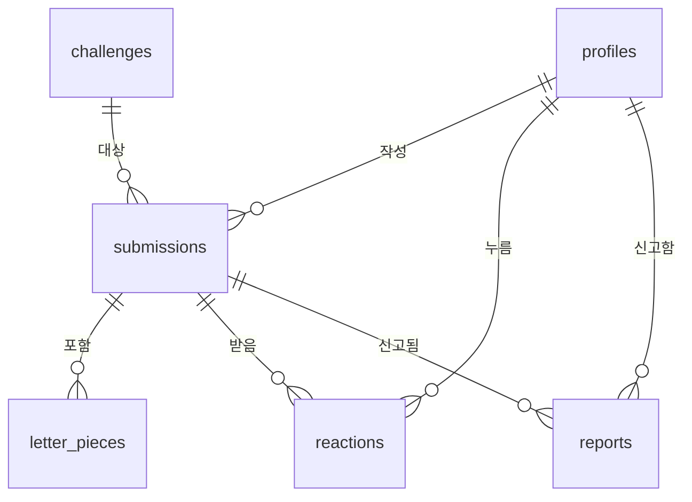
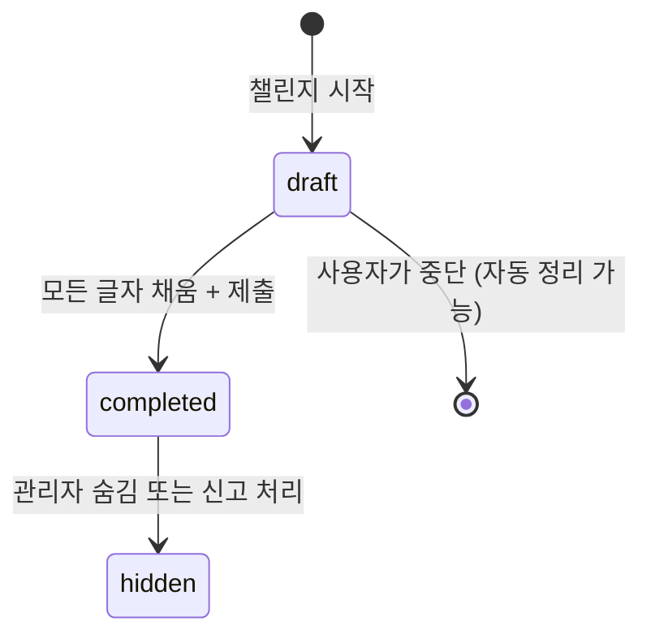

# Typolog — Data Model

## 개요



## 테이블 상세

### profiles (사용자 프로필)

Supabase Auth의 `auth.users`를 확장하는 공개 프로필 테이블.

| 필드 | 타입 | 제약조건 | 설명 |
|------|------|---------|------|
| `id` | UUID | PK, FK → auth.users(id) | Supabase Auth UID와 동일 |
| `nickname` | TEXT | NOT NULL | 표시 이름 (2~20자) |
| `avatar_url` | TEXT | nullable | 프로필 이미지 URL |
| `created_at` | TIMESTAMPTZ | DEFAULT now() | 가입 시각 |
| `updated_at` | TIMESTAMPTZ | DEFAULT now() | 최종 수정 시각 |

**설계 판단**:
- `auth.users`에 직접 칼럼을 추가하지 않고 별도 테이블로 분리. Supabase Auth 스키마를 건드리지 않는 것이 안전함.
- 회원가입 시 DB trigger로 자동 생성 (`on auth.users insert → insert into profiles`).
- `nickname`은 unique 제약을 MVP에서는 걸지 않음 (중복 허용). 나중에 필요하면 추가.

**RLS 고려사항**:
- SELECT: 모든 인증 사용자가 다른 사용자의 닉네임과 아바타 조회 가능 (피드 카드 표시)
- UPDATE: 본인만 수정 가능 (`auth.uid() = id`)
- INSERT: DB trigger로만 생성 (직접 INSERT 차단)
- DELETE: 차단 (계정 삭제는 별도 플로우)

---

### challenges (오늘의 챌린지 문장)

| 필드 | 타입 | 제약조건 | 설명 |
|------|------|---------|------|
| `id` | UUID | PK, DEFAULT gen_random_uuid() | |
| `sentence` | TEXT | NOT NULL | 전체 문장, 표시용 ("오늘도 화이팅"). `lines`에서 파생 |
| `lines` | TEXT[] | NOT NULL | 작성자가 지정한 줄 배열 (단일 소스). 예: ["오늘도","화이팅"] |
| `letters` | TEXT[] | NOT NULL | 개별 글자 배열 (공백 제외), `lines`에서 파생 |
| `active_date` | DATE | NOT NULL, UNIQUE | 이 문장이 활성화되는 날짜 |
| `created_at` | TIMESTAMPTZ | DEFAULT now() | |

**설계 판단**:
- **`lines`가 단일 소스(single source of truth)**. 작성자(관리자)가 콜라주 줄 배치를 직접 지정한다. 줄나눔을 알고리즘으로 추측하지 않는 이유: 한글은 단어 중간이 끊기면 어색함("우리 동네 맛집" → 우리동/네맛집 = 영어 coffee→cof/fee 느낌). 줄 수는 작성자 자유.
- `sentence`(표시용) = `lines.join(" ")`, `letters`(슬롯용) = 각 줄에서 공백/특수문자 제거 후 flatten. 예: lines=["오늘도","화이팅"] → sentence="오늘도 화이팅", letters=["오","늘","도","화","이","팅"]
- 수집(`/challenge/[id]`)·preview·PNG export 세 화면이 모두 `lines`를 기준으로 **동일하게** 줄나눔.
- `active_date`에 UNIQUE 제약 → 날짜당 하나의 문장만 보장
- 문장 등록은 관리자(서비스 키)만 가능. Phase 1(mock)에서는 mock 데이터에 `lines` 직접 지정, Phase 2 admin UI는 줄별 입력 폼(↔ `lines` 배열)으로 등록. MVP 서버에서는 seed SQL로 등록

**RLS 고려사항**:
- SELECT: 모든 사용자 (비인증 포함) 조회 가능
- INSERT/UPDATE/DELETE: 서비스 키만 (RLS에서 차단, admin client로만 접근)

---

### submissions (제출물)

| 필드 | 타입 | 제약조건 | 설명 |
|------|------|---------|------|
| `id` | UUID | PK, DEFAULT gen_random_uuid() | |
| `user_id` | UUID | FK → profiles(id) ON DELETE CASCADE, NOT NULL | 작성자 |
| `challenge_id` | UUID | FK → challenges(id), NOT NULL | 대상 챌린지 |
| `status` | TEXT | NOT NULL, DEFAULT 'draft' | 'draft' / 'completed' / 'hidden' |
| `is_public` | BOOLEAN | DEFAULT true | 피드 공개 여부 |
| `collage_image_url` | TEXT | nullable | 최종 콜라주 이미지 URL |
| `created_at` | TIMESTAMPTZ | DEFAULT now() | draft 생성 시각 |
| `completed_at` | TIMESTAMPTZ | nullable | 완성 시각 |

**제약조건**:
- `UNIQUE (user_id, challenge_id)` — 사용자당 챌린지당 하나의 제출만 허용
- `CHECK (status IN ('draft', 'completed', 'hidden'))`

**상태 전이**:



**설계 판단**:
- `draft`는 글자 수집 진행 중. 모든 슬롯을 채우고 제출해야 `completed`로 전환
- `hidden`은 신고 누적 또는 관리자 판단으로 피드에서 숨김
- `collage_image_url`은 제출 시점에 채워짐
- 사용자당 챌린지당 1개 제한 → 하루에 같은 문장을 여러 번 제출하는 것을 방지

**RLS 고려사항**:
- SELECT (본인): 모든 상태 조회 가능
- SELECT (타인): `status = 'completed' AND is_public = true`인 것만
- INSERT: 인증 사용자, `user_id = auth.uid()`
- UPDATE: 본인만 (`user_id = auth.uid()`), status를 'hidden'으로 바꾸는 것은 서비스 키만
- DELETE: 차단 (soft delete = hidden)

---

### letter_pieces (글자 조각)

| 필드 | 타입 | 제약조건 | 설명 |
|------|------|---------|------|
| `id` | UUID | PK, DEFAULT gen_random_uuid() | |
| `submission_id` | UUID | FK → submissions(id) ON DELETE CASCADE, NOT NULL | 소속 제출 |
| `character` | TEXT | NOT NULL | 글자 ("오") |
| `slot_index` | INTEGER | NOT NULL | 슬롯 위치 (0부터) |
| `image_url` | TEXT | NOT NULL | Storage URL |
| `width` | INTEGER | NOT NULL | crop 이미지 너비 (px) |
| `height` | INTEGER | NOT NULL | crop 이미지 높이 (px) |
| `created_at` | TIMESTAMPTZ | DEFAULT now() | |

**제약조건**:
- `UNIQUE (submission_id, slot_index)` — 하나의 제출에서 슬롯 위치 중복 불가
- `ON DELETE CASCADE` — submission 삭제 시 자동 삭제

**설계 판단**:
- `character`는 검증용. 이 슬롯에 "오"가 들어가야 하는데 실제 이미지가 "오"인지는 검증하지 않음 (OCR 미사용)
- `width`, `height`는 콜라주 렌더링 시 비율 계산에 사용
- 글자 교체 시 기존 레코드를 UPSERT (slot_index 기준)

**RLS 고려사항**:
- SELECT: submission의 소유자만 (비공개) / 공개 submission이면 모두
- INSERT/UPDATE: submission의 소유자만
- DELETE: submission의 소유자만

---

### reactions (좋아요)

| 필드 | 타입 | 제약조건 | 설명 |
|------|------|---------|------|
| `id` | UUID | PK, DEFAULT gen_random_uuid() | |
| `user_id` | UUID | FK → profiles(id) ON DELETE CASCADE, NOT NULL | 누른 사람 |
| `submission_id` | UUID | FK → submissions(id) ON DELETE CASCADE, NOT NULL | 대상 제출 |
| `type` | TEXT | NOT NULL, DEFAULT 'like' | 반응 종류 (MVP: 'like'만) |
| `created_at` | TIMESTAMPTZ | DEFAULT now() | |

**제약조건**:
- `UNIQUE (user_id, submission_id)` — MVP에서는 'like'만이므로 이 제약으로 충분. 향후 이모지 반응 확장 시 `UNIQUE (user_id, submission_id, type)`으로 변경 필요

**설계 판단**:
- `type` 필드를 두어 나중에 이모지 반응 등으로 확장 가능. MVP에서는 'like'만. 확장 시 UNIQUE 제약조건도 함께 마이그레이션 필요
- 좋아요 취소 = 레코드 DELETE (토글)
- 자신의 제출에도 좋아요 가능 (제한하지 않음)

**RLS 고려사항**:
- SELECT: 모든 인증 사용자 (피드에서 좋아요 수/상태 표시)
- INSERT: 인증 사용자, `user_id = auth.uid()`
- DELETE: 본인이 누른 것만 (`user_id = auth.uid()`)
- UPDATE: 차단 (삭제 후 재생성)

---

### reports (신고)

| 필드 | 타입 | 제약조건 | 설명 |
|------|------|---------|------|
| `id` | UUID | PK, DEFAULT gen_random_uuid() | |
| `reporter_id` | UUID | FK → profiles(id) ON DELETE CASCADE, NOT NULL | 신고한 사람 |
| `submission_id` | UUID | FK → submissions(id) ON DELETE CASCADE, NOT NULL | 신고 대상 |
| `reason` | TEXT | NOT NULL | 신고 사유 |
| `created_at` | TIMESTAMPTZ | DEFAULT now() | |

**설계 판단**:
- 같은 사용자가 같은 제출을 여러 번 신고하는 것은 제한하지 않음 (MVP 단순화). 필요하면 UNIQUE 추가
- 신고 누적 시 자동 숨김은 MVP에서 미구현. 관리자가 SQL로 확인 후 수동 처리
- 신고 사유는 자유 텍스트. 카테고리 분류는 나중에

**RLS 고려사항**:
- SELECT: 차단 (일반 사용자는 신고 내역을 볼 수 없음)
- INSERT: 인증 사용자, `reporter_id = auth.uid()`
- UPDATE/DELETE: 차단

---

### event_logs (이벤트 로그)

> **참고**: MVP에서는 PostHog로 이벤트를 전송하며, DB에 별도 저장하지 않는다. 이 테이블은 향후 자체 분석이 필요할 때를 위한 설계 초안이다.

| 필드 | 타입 | 제약조건 | 설명 |
|------|------|---------|------|
| `id` | UUID | PK, DEFAULT gen_random_uuid() | |
| `user_id` | UUID | nullable | 비인증 이벤트 가능 |
| `event_name` | TEXT | NOT NULL | 이벤트 이름 |
| `properties` | JSONB | DEFAULT '{}' | 이벤트 속성 |
| `created_at` | TIMESTAMPTZ | DEFAULT now() | |

**MVP 판단**: 이 테이블은 Phase 4 이후에 필요성을 판단. PostHog이 충분하면 만들지 않는다.

---

## 관계 요약

```
profiles 1:N submissions     (한 사용자가 여러 챌린지에 참여)
challenges 1:N submissions   (하나의 챌린지에 여러 사용자 참여)
submissions 1:N letter_pieces (하나의 제출에 여러 글자 조각)
submissions 1:N reactions     (하나의 제출에 여러 좋아요)
submissions 1:N reports       (하나의 제출에 여러 신고)
profiles 1:N reactions        (한 사용자가 여러 좋아요)
profiles 1:N reports          (한 사용자가 여러 신고)
```

**무결성 규칙**:
- `submissions` 삭제 시 → `letter_pieces`, `reactions`, `reports` CASCADE 삭제
- `profiles` 삭제 시 → `submissions`, `reactions`, `reports` CASCADE 삭제
- `challenges`는 삭제하지 않음 (아카이브)

## 인덱스 전략

```sql
-- 오늘의 챌린지 빠른 조회
CREATE INDEX idx_challenges_active_date ON challenges(active_date);

-- 피드 쿼리: 특정 챌린지의 공개 완성 제출 (cursor pagination용 id 포함)
CREATE INDEX idx_submissions_feed
  ON submissions(challenge_id, created_at DESC, id)
  WHERE status = 'completed' AND is_public = true;

-- 사용자별 제출 목록
CREATE INDEX idx_submissions_user ON submissions(user_id, created_at DESC);

-- 제출별 좋아요 수 집계
CREATE INDEX idx_reactions_submission ON reactions(submission_id);

-- 제출별 글자 조각 조회
CREATE INDEX idx_letter_pieces_submission ON letter_pieces(submission_id);
```

## RLS 정책 요약표

| 테이블 | SELECT | INSERT | UPDATE | DELETE |
|--------|--------|--------|--------|--------|
| profiles | 모두 (닉네임/아바타) | trigger만 | 본인 | 차단 |
| challenges | 모두 | 서비스키 | 서비스키 | 서비스키 |
| submissions | 본인: 전체 / 타인: 공개완성만 | 인증(본인) | 본인 | 차단 |
| letter_pieces | submission 소유자 | submission 소유자 | submission 소유자 | submission 소유자 |
| reactions | 모두 (인증) | 인증(본인) | 차단 | 본인 |
| reports | 차단 | 인증(본인) | 차단 | 차단 |
