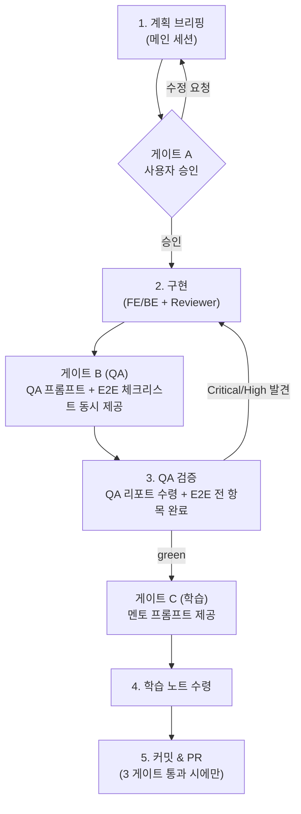

# Typolog — Day 작업 사이클 (모든 Phase 공통 규칙)

> 이 문서는 **모든 Phase(1~5)의 Day 단위 작업이 반드시 따르는 공통 절차**를 정의한다.
> Phase 1(프론트엔드)에서 실제로 운영하던 방식을 명문화한 것으로, Phase 2(백엔드) 이후에도 동일하게 적용된다.
> 구속력: `CLAUDE.md`의 "Day 작업 사이클" 규칙이 이 문서를 가리킨다. 에이전트·사용자 모두 이 절차를 따른다.

---

## 1. 한눈에 보기

각 Day는 **7단계 / 3개 차단 게이트**로 진행된다. 게이트를 통과하기 전에는 다음 단계로 넘어가지 않는다.



```
Day N 시작
 │
 1. 계획 브리핑        그날의 작업 범위·변경 파일·완료조건을 브리핑한다.
 │
 ╞═ 게이트 A (승인) ══  사용자 승인 전 구현 금지. 수정 요청 시 1번으로 복귀.
 │
 2. 구현              담당 에이전트(Frontend/Backend)가 구현하고 Reviewer가 검토한다. 파일 5개 이내(직접 작성 기준).
 │
 ╞═ 게이트 B (QA) ════  두 산출물을 동시에 제공한다:
 │                      (a) QA 에이전트에 붙여넣을 QA 프롬프트
 │                      (b) 사용자 직접 E2E 검증용 수동 체크리스트
 │
 3. QA 검증           QA 리포트(docs/reviews/…)를 수령하고, 사용자가 E2E 체크리스트 전 항목을 완료한다.
 │                    └ Critical/High 발견 시 → 2번(구현)으로 복귀 (gate fail).
 │
 ╞═ 게이트 C (학습) ══  멘토 에이전트에 붙여넣을 학습 프롬프트를 제공한다.
 │
 4. 학습              학습 노트(docs/learning/…)를 수령한다.
 │
 5. 커밋 & PR         세 게이트를 모두 통과했을 때만 그날 작업을 커밋하고 PR을 연다. (AI 서명 없음)
```

---

## 2. 게이트 정의 (차단 규칙)

| 게이트 | 위치 | 통과 조건 | 실패 시 |
|--------|------|----------|---------|
| **A. 승인** | 브리핑 → 구현 사이 | 사용자가 그날 계획을 명시적으로 승인 | 수정 요청을 반영해 1번(브리핑)으로 복귀 |
| **B. QA** | 구현 → 커밋 사이 | QA 리포트 수령 + 사용자 E2E 체크리스트 **전 항목 완료** + Critical/High **0건** | 2번(구현)으로 복귀해 수정 후 재검증 |
| **C. 학습** | QA 통과 → 커밋 사이 | 그날 작업의 학습 노트(`docs/learning/…`) 수령 | 멘토 프롬프트 재실행 |

> **핵심 원칙**: 게이트는 "차단 지점"이다. 통과 전에는 절대 다음 단계로 진행하지 않는다.
> 특히 **승인 없는 구현 금지**(게이트 A)와 **3 게이트 모두 통과 전 커밋 금지**(게이트 B·C)는 반드시 지킨다.

---

## 3. 단계별 상세

### 1. 계획 브리핑 (메인 세션)
- 그날 작업의 **범위**, 예상 **변경 파일 목록**, **완료 조건**을 사용자에게 브리핑한다.
- 작업 단위 기준은 `docs/agent-view-workflow.md`의 "작업 단위 쪼개는 기준"을 따른다 (파일 5개 이내, 의미 있는 1커밋).
- 새 세션에서 Day를 시작할 땐 아래 **"Day 킥오프 프롬프트 템플릿"(§9)**을 채워 붙여넣어 시작한다.

### 2. 구현 (Frontend / Backend Agent + Reviewer)
- 담당 에이전트가 승인 범위 **안에서만** 구현한다. 범위를 벗어나면 게이트 A로 되돌아가 재승인.
- 구현 후 Reviewer 에이전트가 코드 리뷰·보안·타입 안전성을 점검한다.
- 파일 소유권은 `docs/agent-view-workflow.md`를 따른다 (같은 파일 동시 수정 금지).

### 3. QA 검증 (게이트 B)
- 메인 세션이 **QA 프롬프트(6번)**와 **E2E 체크리스트(8번)**를 동시에 산출한다.
- QA 에이전트가 `docs/reviews/phase{N}-day{M}-qa-review.md`를 작성한다.
- 사용자가 E2E 체크리스트 전 항목을 직접 확인·완료한다.
- Critical/High가 있으면 구현으로 복귀. Medium은 다음 Day 이관 가능(리뷰에 근거 기록).

### 4. 학습 (게이트 C)
- 메인 세션이 **멘토 프롬프트(7번)**를 산출한다.
- Mentor 에이전트가 `docs/learning/phase-{N}-day-{M}.md`를 작성한다.

### 5. 커밋 & PR
- 세 게이트 통과 후, 그날 작업을 **작업 단위별 커밋**으로 나눠 커밋하고 **Day 단위 PR 1개**를 연다.
- 커밋을 쪼개는 기준은 `docs/agent-view-workflow.md`의 "작업 단위 쪼개는 기준"을 따른다 (하나의 작업 = 하나의 의미 있는 커밋, 분리 금지 케이스 — 예: DB 스키마 DDL + RLS 정책 — 준수).
- 커밋 메시지·PR 본문에 **AI 공동저자/생성 서명을 넣지 않는다.**
- 커밋 메시지는 영어, 설명은 한국어 (CLAUDE.md 규칙).

---

## 4. 산출물 & 네이밍 맵

| 산출물 | 경로 패턴 | 담당 | 비고 |
|--------|----------|------|------|
| QA 리뷰 | `docs/reviews/phase{N}-day{M}-qa-review.md` | QA 에이전트 | 예: `phase2-day1-qa-review.md` |
| 학습 노트 | `docs/learning/phase-{N}-day-{M}.md` | Mentor 에이전트 | 예: `phase-2-day-1.md` |
| 커밋 / PR | 작업 단위별 커밋 + Day 단위 PR 1개 | 메인 세션 | AI 서명 없음 |

> ⚠️ **네이밍 불일치 (의도적 유지)**: 두 디렉토리의 기존 관례가 다르다.
> - `docs/reviews/` → `phase{N}-day{M}-...` (대시 없음: `phase2-day1`)
> - `docs/learning/` → `phase-{N}-day-{M}.md` (대시 있음: `phase-2-day-1`)
>
> Phase 1 산출물과의 일관성을 위해 **각 디렉토리의 기존 관례를 그대로 따른다.** (통일은 별도 작업으로 결정)

---

## 5. 에이전트 역할 매핑

| 단계 | 에이전트 | 정의 파일 | 산출물 형식 |
|------|---------|----------|------------|
| 구현 (UI/Canvas/Zustand) | Frontend | `.claude/agents/frontend-agent.md` | 구현 + 자기 검증 |
| 구현 (DB/API/Auth/RLS/Storage) | Backend | `.claude/agents/backend-agent.md` | 구현 + 자기 검증 |
| 코드/보안 리뷰 | Reviewer | `.claude/agents/reviewer-agent.md` | 리뷰 코멘트 |
| QA 검증 (게이트 B) | QA | `.claude/agents/qa-agent.md` | QA 리뷰 md |
| 학습 노트 (게이트 C) | Mentor | `.claude/agents/mentor-agent.md` | 학습 노트 md |

전체 에이전트 운영·파일 소유권·병렬 작업 규칙은 `docs/agent-view-workflow.md` 참조.

---

## 6. QA 프롬프트 템플릿 (게이트 B — QA 에이전트에 붙여넣기)

`{ }` 부분만 그날 작업에 맞게 채워서 QA 에이전트에 전달한다.

```
Phase {N} Day {M} 작업을 QA 검증해줘.

[범위]
{그날 구현한 기능 요약 — 예: Supabase 스키마 6개 테이블 + RLS 정책 + profiles trigger}

[변경 파일]
{변경/신규 파일 목록 — 예: src/db/schema.ts, supabase/migrations/0001_init.sql, ...}

[검증 방식]
- 정적 리뷰 + 실제 실행 검증(가능한 범위에서 browse, iPhone 14 뷰포트 / DB·API는 실제 쿼리 실행)
- 이슈를 Critical / High / Medium 으로 분류하고 각 판정 근거를 적을 것
- QA 체크포인트 표(체크포인트 / 결과 / 검증 방법)를 작성할 것
- 사용자용 모바일 수동 테스트 체크리스트를 포함할 것
- type-check / lint / test 결과를 기록할 것
- 마지막에 "커밋 가능 여부"를 명시할 것

[결과 저장]
docs/reviews/phase{N}-day{M}-qa-review.md 에 작성해줘.

[참고]
docs/testing-strategy.md, docs/product-brief.md, (백엔드면) docs/backend-design-plan.md
```

> QA 에이전트의 응답은 자기 출력 형식(작업 요약 / 변경·검토 대상 / 핵심 판단 / 리스크 / 다음 액션 / 내가 배워야 할 개념)을 따른다. 위 프롬프트는 그 위에 **리뷰 md 산출물 형식**을 추가로 지시한다.

---

## 7. Mentor 프롬프트 템플릿 (게이트 C — Mentor 에이전트에 붙여넣기)

```
Phase {N} Day {M}에서 구현한 {기능}을 학습 노트로 정리해줘.

[이번 Day에 새로 등장한 개념]
{개념 목록 — 예: RLS, Drizzle 스키마, Supabase Auth OAuth, DB trigger, UPSERT}

[요구 사항]
- Why 먼저: "왜 이걸 쓰는가"를 먼저 설명
- 모든 설명을 이 프로젝트의 실제 코드(파일:줄)와 연결 ("Typolog에서는…")
- 비유/예시로 직관 제공
- "자주 하는 실수" 섹션 포함
- 다음 Day 작업 전에 알면 좋은 선행 개념까지 연결

[결과 저장]
docs/learning/phase-{N}-day-{M}.md 에 작성하고,
docs/learning/learning-roadmap.md 의 해당 항목을 [x]로 체크해줘.

[참고]
docs/architecture.md, docs/data-model.md, 직전 학습 노트
```

> Mentor 에이전트의 응답·노트 내부 구조는 `mentor-agent.md`의 형식(한 줄 요약 / 왜 필요한가 / Typolog에서는 / 핵심 원리 / 자주 하는 실수 / 나중에 배울 것)을 따른다.

---

## 8. E2E 체크리스트 스켈레톤 (게이트 B — 사용자 직접 검증)

QA 에이전트의 자동 검증과 **별개로**, 사용자가 직접 손으로 확인하는 항목이다. 그날 작업에 맞게 채운다.

```markdown
### Phase {N} Day {M} — 사용자 E2E 체크리스트

#### 핵심 플로우
- [ ] {그날 구현한 주요 동작이 실제로 동작하는가}
- [ ] {입력 → 처리 → 결과가 기대대로인가}

#### 회귀 방지 (이전 Day 동작 유지)
- [ ] {이전 Day에 만든 기능이 여전히 동작하는가}

#### 엣지 / 실패 케이스
- [ ] {빈 값 / 권한 거부 / 네트워크 끊김 등에서 안 깨지는가}

#### 플랫폼
- [ ] iOS Safari: {확인 항목}
- [ ] Android Chrome: {확인 항목}

#### 콘솔/에러
- [ ] 콘솔 에러 0건
```

> 백엔드(Phase 2+) Day는 위에 더해 **권한 검증 시나리오**(예: 타인의 비공개 제출 접근 시 404, 비로그인 접근 차단)를 반드시 포함한다.

---

## 9. Day 킥오프 프롬프트 템플릿 (세션 시작 시)

새 세션에서 한 Day를 시작할 때 붙여넣는 프롬프트. `{ }`만 그 Day에 맞게 채운다.
상단 1~8절이 "고정 규칙"이고, 이 템플릿은 그것들을 한 세션으로 불러오는 **얇은 부트스트랩**이다 — 규칙 본문을 여기에 복붙하지 말고 문서를 가리키게 둔다(중복=drift).

```
# Typolog — Phase {N} Day {M} 착수

너는 Typolog의 {Frontend|Backend} 개발을 시작한다. 지금은 Phase {N} Day {M}이다.

## 0. 가장 먼저 (코드 작성 전)
아래 문서를 읽고 → Day {M} 계획을 브리핑하고 → 내 명시적 승인을 받기 전에는 구현하지 마라.
모든 Day는 docs/day-workflow.md의 3-게이트 사이클(승인→QA→학습)을 따른다.

## 1. 현재 상태 (이 Day 시작 시점)
{직전까지 끝난 것 / 아직 안 된 것 — 예: 머지된 PR, 설치/미설치 패키지, 준비된 .env, 없는 스캐폴딩}

## 2. 반드시 읽을 자료
- docs/day-workflow.md (진행 규칙)
- docs/backend-design-plan.md ({해당 Phase 설계}), docs/roadmap.md, docs/data-model.md, docs/architecture.md
- CLAUDE.md, docs/agent-view-workflow.md (규칙 + 파일 소유권)
- .claude/agents/{관련 에이전트}.md

## 3. 스킬 / 도구
{설치된 스킬과 활용 — 단 CLAUDE.md·design doc이 항상 source of truth}

## 4. 이번 Day 범위
{backend-design-plan §9 등에서 그 Day 작업 항목. 이미 끝난 항목은 ✅로 표시해 중복 작업 방지}

## 5. 먼저 정할 결정사항
{브리핑에서 확정할 선택지들 — 권장안 + 근거 제시 후 승인}

## 6. 지켜야 할 룰
CLAUDE.md를 따른다. 핵심: 한국어 설명/영어 코드·커밋, any 금지(CI 차단), 5파일 이내,
승인 후 구현, 보안(서비스키/DATABASE_URL 비노출), AI 서명 없음, Day마다 새 worktree/브랜치,
커밋·PR 전 `pnpm lint && type-check && test:run` 통과.

## 7. 너의 첫 응답
문서를 읽고 Day {M} 계획을 브리핑하라(결정사항 권장안 + 파일 목록 5개 이내 + 완료 기준). 그리고 승인을 기다려라.
```

> §1(현재 상태)·§4(이번 Day 범위)는 **매번 새로 채운다**(즉시 stale해지므로 문서에 박지 않는다). 고정 규칙·설계·스코프는 위 2절의 문서들이 단일 소스.

---

## 10. Phase별 적용 메모

- **Phase 0 (세팅)**: 이 사이클의 예외. 메인 세션에서 직접 수행, Day 게이트 미적용.
- **Phase 1 (프론트엔드)**: 이 사이클의 원형. 산출물 예: `docs/reviews/phase1-day6-qa-review.md`, `docs/learning/phase-1-day-6.md`.
- **Phase 2 (백엔드)**: Day 1~5 구현 순서는 `docs/backend-design-plan.md` 9번 참조. 각 Day가 이 사이클을 따른다. QA·E2E에 **권한(RLS/Storage) 검증**을 반드시 포함.
- **Phase 3~5**: 동일 적용.

---

## 11. 요약

```
브리핑 → [승인] → 구현 → [QA: 프롬프트+체크리스트] → 검증 → [학습] → 커밋·PR

게이트 3개(승인 / QA / 학습)는 차단 지점이다.
통과 전에는 다음으로 못 간다. 이것이 Typolog의 Day 작업 표준이다.
```
