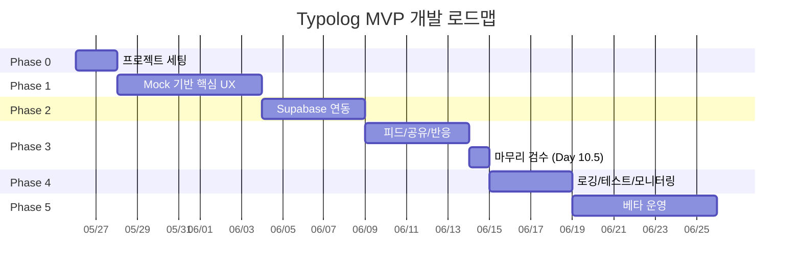
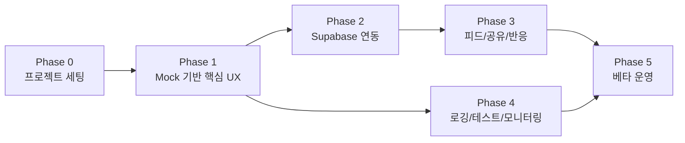

# Typolog — Development Roadmap

> **모든 Phase 공통 절차**: 각 Phase는 Day 단위로 진행되며, 모든 Day 작업은
> `docs/day-workflow.md`의 **3-게이트 사이클**(① 계획 브리핑→[승인] → ② 구현→[QA 게이트] → ③ [학습 게이트] → 커밋·PR)을 따른다.
> (Phase 0 세팅은 예외 — 메인 세션 직접 수행)

## 전체 타임라인 개요

---

## Phase 0: 프로젝트 세팅

### 목표
코드를 작성할 수 있는 환경을 완성한다. `npm run dev`로 빈 페이지가 뜨고, lint/type-check가 통과하며, Vercel Preview가 배포되는 상태.

### 작업

| # | 작업 | 상세 |
|---|------|------|
| 0-1 | Next.js 프로젝트 생성 | `create-next-app`, App Router, TypeScript strict, Tailwind CSS |
| 0-2 | shadcn/ui 초기화 | 기본 컴포넌트 설치 (Button, Dialog, Sheet, Input) |
| 0-3 | 핵심 패키지 설치 | zustand, @tanstack/react-query, drizzle-orm, zod, react-hook-form |
| 0-4 | 폴더 구조 세팅 | `src/` 하위 디렉토리 생성 |
| 0-5 | ESLint + Prettier 설정 | 코드 스타일 통일 |
| 0-6 | Git 초기화 + 초기 커밋 | `.gitignore`, 초기 커밋 |
| 0-7 | CLAUDE.md 작성 | 프로젝트 규칙, 기술 스택, 코딩 컨벤션 |
| 0-8 | `.env.local.example` 작성 | 필요한 환경 변수 목록 |
| 0-9 | Vercel 프로젝트 연결 | Preview URL 확보 |

### 완료 기준
- [ ] `npm run dev` → localhost에서 빈 페이지 정상 표시
- [ ] `npm run lint` → 에러 없음
- [ ] `npm run type-check` → 에러 없음
- [ ] Vercel Preview 배포 성공
- [ ] CLAUDE.md에 프로젝트 컨텍스트 기록 완료

---

## Phase 1: Mock 기반 핵심 UX

### 목표
서버 연동 없이, mock 데이터와 localStorage만으로 **핵심 UX 플로우 전체를 체험**할 수 있게 한다. 카메라로 글자를 찍고, crop하고, 콜라주를 완성하는 과정이 실제로 동작해야 한다.

### 작업

| # | 작업 | 상세 |
|---|------|------|
| 1-1 | 라우팅 + 레이아웃 | Route Groups `(auth)`, `(main)`, 하단 네비게이션 |
| 1-2 | 오늘의 챌린지 화면 (홈) | mock 문장 표시(Challenge.lines 단일 소스 → sentence/letters 파생), "시작하기" 버튼 |
| 1-3 | 글자 슬롯 그리드 UI | 빈 슬롯 / 채운 슬롯 상태 표시 |
| 1-4 | 카메라/갤러리 접근 | `<input type="file" accept="image/*" capture>`, 바텀시트 |
| 1-5 | 이미지 crop UI | react-image-crop 기반 자유 영역 crop: 영역 직접 그리기/꼭짓점·변 드래그로 리사이즈 (react-easy-crop에서 교체) |
| 1-6 | EXIF strip 유틸 | 업로드 전 메타데이터 제거 |
| 1-7 | crop 이미지 → 슬롯 저장 | Zustand store + localStorage persist |
| 1-8 | 콜라주 미리보기 화면 | CSS transform 기반 결정론적 배치(회전/크기/간격 jitter), 배경색 선택. 글자 줄나눔은 Challenge.lines(작성자 지정) 기준 — 수집/preview/PNG 동일. Canvas는 1-9 PNG 생성 단계에서 사용 |
| 1-9 | 콜라주 PNG 생성 | Canvas → toBlob → 다운로드 |
| 1-10 | 진행 상태 복원 | 새로고침 해도 진행 중 상태 유지 (localStorage) |
| 1-11 | 콜라주 줄 배치 작성자 지정 (authored lines) | `Challenge.lines` 단일 소스 도입, `getCollageLines`로 수집/preview/PNG 동일 줄나눔 (방향성 수정, 2026-05-31 추가) |
| 1-12 | E2E 증거 로깅 (dev) | 구조화 로거 `src/lib/debug/log.ts` (콘솔+세션버퍼+내보내기), sink 확장형 |

### 완료 기준
- [ ] 모바일 브라우저에서 카메라 촬영 → crop → 슬롯 채우기 가능
- [ ] 모든 슬롯을 채운 후 콜라주 미리보기 확인 가능
- [ ] 콜라주 PNG 다운로드 가능
- [ ] 새로고침 후에도 진행 상태 유지
- [ ] 세 화면(수집/preview/PNG)이 `Challenge.lines`대로 동일하게 줄나눔
- [ ] mock 데이터 기반이므로 서버 연결 불필요

---

## Phase 2: Supabase 연동

### 목표
mock 데이터를 실제 Supabase로 교체한다. 로그인하고, 글자를 저장하고, 콜라주를 제출하는 전체 플로우가 실제 DB/Storage와 연동된다.

### 작업

| # | 작업 | 상세 |
|---|------|------|
| 2-1 | Supabase 프로젝트 생성 | 프로젝트 설정, API 키 확보 |
| 2-2 | DB 스키마 생성 | Drizzle 스키마 정의(challenges.lines: TEXT[] 포함), 마이그레이션 실행 |
| 2-3 | RLS 정책 설정 | 테이블별 RLS 정책 작성 |
| 2-4 | Supabase Auth 연동 | Google/Kakao OAuth, 세션 관리 |
| 2-5 | Next.js Middleware | 인증 체크, 보호 페이지 리다이렉트 |
| 2-6 | 프로필 자동 생성 | 회원가입 시 profiles 레코드 자동 생성 (DB trigger) |
| 2-7 | 챌린지 API | 오늘의 문장(sentence+lines) 조회, seed 데이터 |
| 2-8 | 제출 생성/수정 API | draft 생성, 완성 처리 |
| 2-9 | 글자 조각 업로드 | Storage 업로드 + letter_pieces 레코드 |
| 2-10 | 콜라주 업로드 | 최종 콜라주 Storage 업로드 |
| 2-11 | Zustand → Server 동기화 | 로컬 draft를 서버에 저장하는 흐름 |
| 2-12 | Storage 버킷 생성 + 정책 | letter-pieces, collages, avatars |

### 완료 기준
- [ ] 소셜 로그인으로 회원가입/로그인 가능
- [ ] 글자 crop → Supabase Storage에 업로드 확인
- [ ] 콜라주 완성 → submissions 테이블에 레코드 생성 확인
- [ ] RLS 정책 동작 확인: 타인의 비공개 제출 접근 불가
- [ ] Vercel Preview에서 전체 플로우 동작

---

## Phase 3: 피드/공유/반응

### 목표
다른 사람의 결과물을 보고, 반응하고, 공유하는 소셜 기능을 완성한다. "같은 문장인데 이렇게 다르구나!"를 체험할 수 있어야 한다.

### 작업

| # | 작업 | 상세 |
|---|------|------|
| 3-1 | 공개 피드 화면 | 오늘의 문장 기준 공개 제출물 목록 |
| 3-2 | 무한 스크롤 | cursor 기반 pagination + TanStack Query |
| 3-3 | 피드 카드 UI | 콜라주 이미지, 닉네임, 좋아요 수 |
| 3-4 | 좋아요 토글 | optimistic update, reactions 테이블 |
| 3-5 | 유저 프로필 | **⏸ 공개 프로필(/u/[handle])은 보류** — profiles에 handle 컬럼 없음, 마이그레이션+공개 프로필 설계는 후속(#62 IA 결론). 본인 콜라주 목록은 Day 9 `/my`로 대체 완료 |
| 3-6 | 공개/비공개 전환 | 제출 후에도 토글 가능 |
| 3-7 | 공유 페이지 | /s/[id], 비인증 접근, OG 메타태그 |
| 3-8 | OG 이미지 생성 | @vercel/og로 동적 OG 이미지 |
| 3-9 | 공유 링크 복사 | 클립보드 복사, 공유 API 연동 |
| 3-10 | 신고하기 | 신고 사유 입력, reports 테이블 저장 |
| 3-11 | 프로필 수정 | 닉네임 변경 (아바타 업로드는 MVP 제외, 필드만 예약) |

### 완료 기준
- [ ] 피드에서 다른 사용자의 공개 콜라주 확인 가능
- [ ] 좋아요 클릭 → 즉시 반영 (optimistic)
- [ ] 공유 링크를 카카오톡/X에 보내면 OG 이미지 미리보기 표시
- [ ] 비인증 사용자가 공유 링크 접근 시 콜라주 확인 + "나도 만들기" 유도
- [ ] 신고 기능 동작

> **Phase 3 → 4 전환 (2026-07-13 게이트 A 확정)**: Day 10(통합 검증 — 산출물 `docs/verification/phase3-integration.md`) 완료 후 **Day 10.5 마무리 검수**(#73)를 거쳐 Phase 4에 진입한다. Day 10.5 범위: #50 업로드 병렬화 구현 · #48 reports UNIQUE · #40-B restore race(조건부) · #40-D Storage 고아 일회성 정리 · Day 10 이슈화 Medium 버그. #40-A(오프라인/에러 UI)·Storage 정기 cleanup 잡은 Phase 4로 이관.

---

## Phase 4: 로깅/테스트/모니터링

### 목표
서비스를 안전하게 운영할 수 있는 기반을 갖춘다. 에러를 감지하고, 유저 행동을 추적하고, 핵심 플로우가 깨지지 않았음을 자동 검증한다.

### 작업

| # | 작업 | 상세 |
|---|------|------|
| 4-1 | Sentry 설정 | 클라이언트 + 서버 에러 트래킹, source map |
| 4-2 | PostHog 설정 | 이벤트 트래킹, 퍼널 대시보드 |
| 4-3 | 핵심 이벤트 계측 | events.md 기준 이벤트 심기 |
| 4-4 | Vitest 설정 + 유닛 테스트 | Canvas 유틸, zod 스키마, Zustand store |
| 4-5 | Playwright 설정 + E2E 테스트 | 핵심 플로우 1개 (로그인 → 완성 → 제출) |
| 4-6 | GitHub Actions CI | lint, type-check, test on PR |
| 4-7 | Vercel Preview 자동 배포 | PR마다 Preview URL |
| 4-8 | 에러 바운더리 | 글로벌 에러 처리 UI |

### 완료 기준
- [ ] Sentry에 에러 리포트가 도착하는 것 확인
- [ ] PostHog에 이벤트가 기록되는 것 확인
- [ ] 퍼널 대시보드 (문장 확인 → 시작 → 완성 → 제출 → 공유) 동작
- [ ] `npm test` → 핵심 유틸 테스트 통과
- [ ] Playwright E2E → 핵심 플로우 통과
- [ ] GitHub Actions PR 체크 통과

---

## Phase 5: 베타 운영

### 목표
소수의 실제 사용자에게 서비스를 공개하고, 첫 피드백을 수집한다.

### 작업

| # | 작업 | 상세 |
|---|------|------|
| 5-1 | 커스텀 도메인 연결 | Vercel에 도메인 설정 |
| 5-2 | 챌린지 문장 시드 데이터 | 2주치 문장 준비 |
| 5-3 | 온보딩 플로우 | 첫 사용자를 위한 간단한 안내 |
| 5-4 | 성능 최적화 | 이미지 로딩, 번들 크기, LCP |
| 5-5 | 모바일 UX 다듬기 | 터치 영역, 스크롤, 키보드 |
| 5-6 | 에러/엣지 케이스 처리 | 네트워크 끊김, 카메라 권한 거부, Storage 용량 |
| 5-7 | 베타 테스터 모집 + 배포 | 10~20명 규모 |
| 5-8 | 피드백 수집 + 분석 | PostHog 퍼널 확인, 직접 피드백 |

### 완료 기준
- [ ] 실제 사용자 10명 이상이 콜라주를 완성
- [ ] 퍼널 데이터로 이탈 구간 파악
- [ ] 크리티컬 버그 0건
- [ ] 사용자 피드백 기반 개선 목록 정리

---

## Phase별 의존 관계

**핵심 포인트**: Phase 4는 Phase 1 이후부터 병렬로 시작 가능. 테스트와 모니터링은 일찍 시작할수록 좋다.
